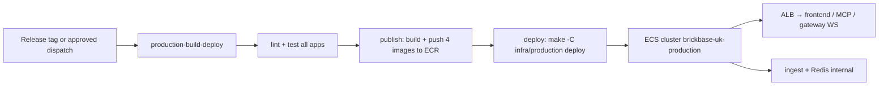
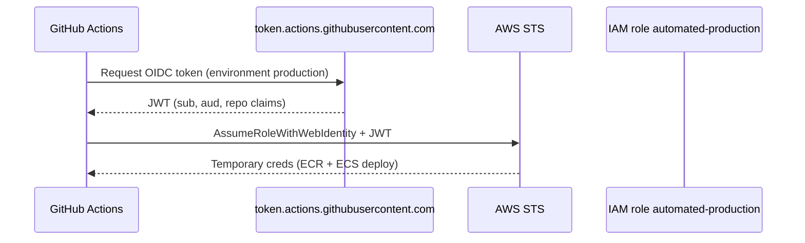
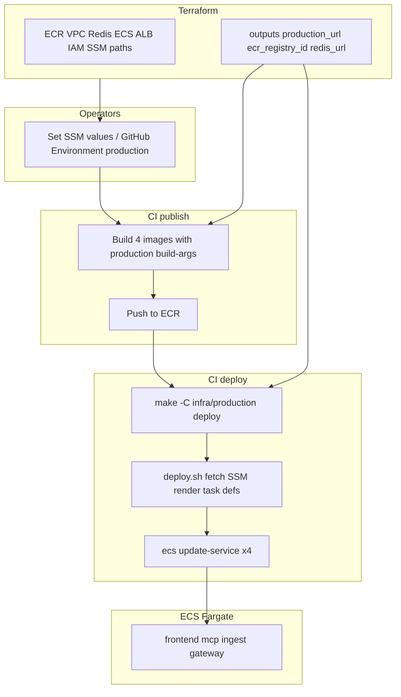

# PRD: AWS Services for Brickbase Production (Terraform + ECS Fargate)

## Objective

Provision the AWS infrastructure required to run **all Brickbase monorepo applications** in a **single production environment** on **Amazon ECS with Fargate** (no Kubernetes):

1. Build and push Docker images to ECR on CI (one repository per app).
2. Deploy task definitions and ECS services via `make -C infra/production deploy` (ECS API only — no Kubernetes/kubectl).
3. Expose the web app, MCP server, and events gateway over HTTPS through an ALB.
4. Run events ingest and gateway with **Amazon ElastiCache for Redis** for the live-feed pub/sub pipeline.

This PRD defines what Terraform must create and [how it is executed](#terraform-execution). Application CI (`.github/workflows/production-build-deploy.yml`, Dockerfiles, `infra/production/Makefile`) is committed in the same repo; operators complete [one-time setup](#one-time-setup-before-first-production-deploy) after the first `terraform apply`.

## Monorepo applications

| App | Path | Nx target | Production role |
|-----|------|-----------|-----------------|
| Web (Next.js) | `apps/web` | `nx run web:build` | Public UI on port **3000** |
| MCP server | `apps/mcp` | `nx run mcp:build` | Smart-contract tools via MCP over HTTP on **`MCP_PORT`** (default **3100**) |
| Events ingest | `apps/events/ingest` | `nx run events:ingest` | Upstream Coinbase + Infura WebSockets → Redis PUBLISH (internal) |
| Events gateway | `apps/events/gateway` | `nx run events:gateway` | Redis SUBSCRIBE → browser WebSocket on **`GATEWAY_PORT`** (default **8081**) |

Shared libraries (`libs/abi`, `libs/shared-config`) and shared types (`apps/events/types`) are compiled into the app images at build time.

## Scope

### In scope

- One AWS region: **eu-west-2** (London).
- **Four ECR repositories:** `brickbase-web`, `brickbase-mcp`, `brickbase-ingest`, `brickbase-gateway`.
- One **ECS cluster on Fargate:** **`brickbase-uk-production`** (no EKS, no node groups, no Kubernetes manifests).
- **Five runtime workloads:**

  | Workload | Source | Public via ALB |
  |----------|--------|----------------|
  | Next.js frontend | `apps/web` | Yes — default listener |
  | MCP server | `apps/mcp` | Yes — path or host rule (HTTP transport required; see [MCP server](#mcp-server-appsmcp)) |
  | Events gateway | `apps/events/gateway` | Yes — WebSocket path `/ws/live` |
  | Events ingest | `apps/events/ingest` | No — internal only |
  | Redis | ElastiCache | No — private subnets only |

- CI-driven deploy from **`.github/workflows/production-build-deploy.yml`** after image publish (release tag or approved manual dispatch).
- Supporting networking, IAM, load balancing, and TLS **references** for a single production hostname (DNS zone, hostname records, and ACM cert are **operator-managed**, not created by Terraform).
- Bootstrap ECS components: ALB, target groups, listener rules, CloudWatch log groups, env-injected `REDIS_URL`.

### Out of scope

- **Kubernetes / EKS / Helm / kubectl** — explicitly excluded from production.
- Multi-region or multi-cluster topology.
- RDS, S3 asset buckets, analytics (Matomo), or other application backends not listed above.
- Feature-branch ephemeral environments.
- Backend API beyond the apps listed above.

### Application prerequisite (not Terraform)

| App | Current local mode | Production requirement |
|-----|-------------------|------------------------|
| `apps/web` | `nx run web:serve` | Container on port **3000**; Next.js `output: "standalone"` in Docker build |
| `apps/mcp` | **stdio** MCP transport | **HTTP** (Streamable HTTP or SSE) listener on **`MCP_PORT`** (default **3100**) — required before Fargate deploy; stdio cannot run behind ALB |
| `apps/events/ingest` | `nx run events:ingest` | Long-running Fargate task; **one replica** (single upstream Coinbase/Infura WebSocket connections) |
| `apps/events/gateway` | `nx run events:gateway` | Fargate service behind ALB; **2–4 tasks** for fan-out; port **`GATEWAY_PORT`** (default **8081**) |

## Live feeds architecture (events)

Production runs the **display-only** live ticker pipeline: Coinbase ETH/USD spot + Infura block headers → Redis → WebSocket → browser. This is **additive** — it does not replace on-chain `OracleRouter` polling in the web app or MCP `get_oracle_prices`.

```
Coinbase WS (ETH-USD)     Infura WS (newHeads)
        │                         │
        └──────────┬──────────────┘
                   ▼
        apps/events/ingest  →  Redis PUBLISH + last-value keys
                   │
                   ▼
           ElastiCache Redis
                   │
                   ▼
        apps/events/gateway  →  WebSocket fan-out (/ws/live)
                   │
                   ▼
              apps/web (LiveTicker via NEXT_PUBLIC_WS_LIVE_URL)
```

**Design rules:**

- **One ingest task** in production — one upstream connection each to Coinbase and Infura; scaling ingest would duplicate upstream sessions.
- **Multiple gateway tasks** (2–4) share one Redis subscription; ALB distributes browser WebSocket connections.
- Live feed data is **display-only** — no smart-contract reads/writes, no settlement logic, no changes to MCP contract tools.
- Ingest reconnects within ~30 s on upstream drop; gateway validates `Origin` against **`GATEWAY_ALLOWED_ORIGINS`** (must include **`production_url`**).

**Redis channels** (prefix `brickbase:live:`):

| Channel | Publisher | Content |
|---------|-----------|---------|
| `brickbase:live:ticker:eth-usd` | Ingest (Coinbase) | ETH/USD ticker JSON |
| `brickbase:live:chain:head` | Ingest (Infura) | Block header JSON |

Gateway subscribes to both channels and serves **`GATEWAY_WS_PATH`** (default `/ws/live`).

## Target deployment model

### CI/CD flow

**Workflow:** `.github/workflows/production-build-deploy.yml` — **trigger:** GitHub **release published** (recommended) or **`workflow_dispatch`** with approval via GitHub Environment **`production`**.



Production deploys **all four app images** on an **explicit release** (or approved manual run) to reduce blast radius. Deploys are **not** tied to every push to `main`.

Job details: [GitHub Actions integration](#github-actions-integration). Operator bootstrap: [One-time setup before first production deploy](#one-time-setup-before-first-production-deploy).

**Out of scope for CI:** `terraform apply` / `terraform destroy` (manual operator).

### Runtime identity (all apps)

| Setting | Value |
|---------|-------|
| ECS cluster | `brickbase-uk-production` |
| Launch type | **FARGATE** only |
| Region | `eu-west-2` |
| `NODE_ENV` at deploy | `production` |
| Image tag | Git tag (e.g. `v1.2.0`) or commit SHA |

| ECR repository | ECS service name | Container port | ALB |
|----------------|------------------|----------------|-----|
| `brickbase-web` | `brickbase-web` | 3000 | Default HTTPS listener |
| `brickbase-mcp` | `brickbase-mcp` | 3100 (`MCP_PORT`) | Path `/mcp/*` or host `mcp.${production_hostname}` |
| `brickbase-gateway` | `brickbase-gateway` | 8081 (`GATEWAY_PORT`) | Path `/ws/live` (WebSocket) |
| `brickbase-ingest` | `brickbase-ingest` | — (no listener) | None |
| — | ElastiCache Redis | 6379 | None |

ECS Service Auto Scaling: CPU target **50%**; frontend/gateway/mcp min **2** max **4**; ingest fixed at **1**.

### URLs and DNS (production)

Operators must choose **`production_hostname`** before `terraform apply`. All browser-facing and build-time URL configuration derives from it.

#### Canonical public URL

| Name | Formula / value | Used by |
|------|-----------------|---------|
| **`production_hostname`** | Pre-existing FQDN (variable only; no scheme) | ALB listener rules, CI `NEXT_PUBLIC_APP_URL`, outputs |
| **`production_url`** | `https://${production_hostname}` | Public browser URL; smoke tests; **`NEXT_PUBLIC_APP_URL`** at image build |
| **ALB DNS** | Terraform output `alb_dns_name` | Debugging only — **do not** use in app env vars or WalletConnect config |

#### What is the ALB?

An **Application Load Balancer (ALB)** terminates **TLS** (using the operator-provided ACM certificate for `production_hostname`) and routes HTTP/HTTPS/WebSocket traffic to **ECS Fargate tasks** registered in target groups. Terraform (or the deploy step) owns listener rules and target groups directly — there is no Ingress controller and no Kubernetes.

The ALB gets an AWS-assigned DNS name (e.g. `brickbase-production-a1b2c3d4.eu-west-2.elb.amazonaws.com`). That name is **not** the product URL.

#### ALB-only smoke test vs canonical URL

| Approach | URL example | Valid for | Limitations |
|----------|-------------|-----------|-------------|
| **ALB-only smoke test** | `curl -I -H "Host: app.brickbase.com" https://<alb_dns_name>/` | Ops checking target groups and listener rules | ACM cert is for `production_hostname`, not the ALB name → browser HTTPS warnings; **not** suitable for WalletConnect or live WebSockets in a browser |
| **Canonical URL** (required) | `https://app.brickbase.com` (`production_url`) | Users, wallets, CI acceptance tests, `NEXT_PUBLIC_APP_URL` | Needs operator Route 53 alias + issued ACM cert + image built with matching `NEXT_PUBLIC_APP_URL` |

Use **`production_url`** for all product and CI acceptance tests. Use **`alb_dns_name`** only for infrastructure debugging.

#### ALB routing (production)

| Traffic | ALB rule (example) | Target group | Notes |
|---------|-------------------|--------------|-------|
| Web UI | Default `HTTPS:443` | `brickbase-web` | Next.js on port 3000 |
| Live WebSocket | Path `/ws/live*` (priority 10) | `brickbase-gateway` | ALB supports WebSocket upgrade |
| MCP HTTP | Path `/mcp/*` (priority 20) or host `mcp.${production_hostname}` | `brickbase-mcp` | Requires MCP HTTP transport in app |
| Health | Path `/health` on gateway TG | `brickbase-gateway` | Target group health checks |

Ingest has **no** ALB attachment. Gateway and ingest reach Redis via **`REDIS_URL`** (Terraform output `redis_url`).

#### Build-time URLs for WebSocket

| Variable | Production example | Notes |
|----------|-------------------|-------|
| `NEXT_PUBLIC_WS_LIVE_URL` | `wss://app.brickbase.com/ws/live` | Baked into frontend image at build |
| `GATEWAY_ALLOWED_ORIGINS` | `https://app.brickbase.com` | Runtime env on gateway service |

**Rules:**

- **`production_url` uses HTTPS** (port 443 via ALB).
- **`NEXT_PUBLIC_APP_URL` must equal `production_url`** (same scheme and host, no trailing slash) when building the frontend image in CI.
- **`GATEWAY_ALLOWED_ORIGINS`** must include **`production_url`** so the browser WebSocket origin is allowed.
- **`NEXT_PUBLIC_WS_LIVE_URL`** must use **`wss://`** and point at the gateway path on `production_hostname`.

#### DNS and TLS flow

```
production_hostname  →  Route 53 alias A/AAAA (operator)  →  ALB (HTTPS :443)  →  listener rules  →  ECS Fargate tasks
```

| Step | Owner | Requirement |
|------|-------|-------------|
| Hosted zone | **Operator** (pre-existing) | Route 53 zone already contains `production_hostname` |
| ACM | **Operator** (pre-existing) | Issued certificate in **eu-west-2** for `production_hostname` (and MCP host if separate); ARN passed as `acm_certificate_arn` |
| Route 53 alias | **Operator** (after apply) | `production_hostname` → ALB (`terraform output alb_dns_name`) |
| ALB listeners | **Terraform** | HTTPS 443 with `acm_certificate_arn`; HTTP 80 → redirect |

**Terraform does not create:** Route 53 hosted zones, hostname DNS records, ACM certificates, or ACM validation records.

#### Example hostname

| Setting | Example value |
|---------|---------------|
| `production_hostname` | `app.brickbase.com` |
| `production_url` | `https://app.brickbase.com` |

## Architecture

```
Internet
   │
   ▼
Route 53 (production_hostname — operator)
   │
   ▼
ACM certificate (HTTPS — operator ARN)
   │
   ▼
Application Load Balancer (internet-facing)
   │  default → frontend :3000
   │  /ws/live → gateway :8081 (WebSocket)
   │  /mcp/*   → mcp :3100
   ▼
ECS cluster: brickbase-uk-production (Fargate)
   ├── Service: brickbase-web   (ECR brickbase-web)
   ├── Service: brickbase-mcp        (ECR brickbase-mcp)
   ├── Service: brickbase-gateway    (ECR brickbase-gateway)
   └── Service: brickbase-ingest     (ECR brickbase-ingest, no ALB)
              │
              ▼
     ElastiCache Redis (private)
              ▲
              └── ingest PUBLISH; gateway SUBSCRIBE
```

## AWS services to provision (Terraform)

### 1. Amazon ECR

| Repository | Image |
|------------|-------|
| `brickbase-web` | Next.js standalone (`apps/web`) |
| `brickbase-mcp` | MCP HTTP server (`apps/mcp`) |
| `brickbase-ingest` | Events ingest (`apps/events/ingest`) |
| `brickbase-gateway` | Events gateway (`apps/events/gateway`) |

| Setting | Value |
|---------|-------|
| Region | `eu-west-2` |
| Scan on push | Recommended |
| Lifecycle policy | Optional: expire untagged images after N days |

**Outputs required:** repository URLs and ARNs for all four repos; `ecr_registry_id`.

### 2. VPC and networking

Terraform should either **create** a new VPC or **consume** an existing one via variables (document the chosen approach in `infra/production/README.md`).

| Resource | Specification |
|----------|---------------|
| VPC | `/16` CIDR; tagged `project=brickbase`, `environment=production` |
| Subnets | Minimum 2 AZs: **private** for Fargate tasks + ElastiCache; **public** for ALB |
| Internet Gateway | Attached to VPC |
| NAT Gateway | At least one (Fargate tasks need egress for Coinbase, Infura, RPC) |
| Route tables | Public routes to IGW; private routes to NAT |
| Security groups | `alb-sg`, `ecs-tasks-sg`, `redis-sg` with least-privilege rules |

**Security group rules (summary):**

| SG | Inbound | Outbound |
|----|---------|----------|
| ALB | 443, 80 from `0.0.0.0/0` | ECS task ports on `ecs-tasks-sg` |
| ECS tasks | From ALB on app ports; Redis **6379** to `redis-sg` | HTTPS to internet (upstream WS, RPC) |
| Redis | **6379** from `ecs-tasks-sg` only | None required |

**Outputs required:** VPC ID, private/public subnet IDs, security group IDs.

### 3. Amazon ElastiCache (Redis)

| Resource | Specification |
|----------|---------------|
| Engine | Redis **7.x** |
| Deployment | Single-node **cache.t4g.micro** (MVP) or replication group (HA follow-up) |
| Subnets | Private subnet group |
| Auth | Optional `AUTH token` in SSM `/brickbase/production/redis/auth_token` |
| Parameter | `maxmemory-policy` = `noeviction` or `allkeys-lru` — document choice in `infra/production/README.md` |

**Outputs required:** `redis_primary_endpoint`, `redis_url` (e.g. `redis://host:6379`; use `rediss://` if TLS enabled).

Ingest and gateway receive **`REDIS_URL`** at task startup via task definition env or SSM.

### 4. Amazon ECS (Fargate)

| Resource | Specification |
|----------|---------------|
| Cluster name | `brickbase-uk-production` |
| Capacity providers | **FARGATE**; optional **FARGATE_SPOT** for non-ingest services |
| Launch type | **FARGATE** — no EC2 capacity, no Kubernetes |
| Network mode | `awsvpc` — tasks in private subnets |

#### ECS services

| Service | Desired count (default) | CPU / memory | Load balancer |
|---------|----------------------|--------------|---------------|
| `brickbase-web` | 2 | 512 / 1024 | ALB default TG |
| `brickbase-gateway` | 2 | 256 / 512 | ALB path `/ws/live` |
| `brickbase-mcp` | 2 | 256 / 512 | ALB path or host rule |
| `brickbase-ingest` | **1** | 256 / 512 | None |

**Auto Scaling:** Application Auto Scaling on ECS service desired count — CPU target 50%; frontend/gateway/mcp: min 2 max 4; ingest: fixed 1.

**Task execution role:** Pull from ECR, write CloudWatch Logs, read SSM parameters under `/brickbase/production/*`.

**Task role:** Optional SSM read at runtime if not injecting all secrets at deploy time.

**Outputs required:** cluster name, cluster ARN, service names, task definition family names.

### 5. Elastic Load Balancing (ALB)

Provisioned by **Terraform**.

| Setting | Value |
|---------|-------|
| Scheme | Internet-facing |
| Target type | **ip** (Fargate awsvpc mode) |
| Listeners | HTTP 80 → HTTPS redirect; HTTPS 443 with `acm_certificate_arn` |
| Stickiness | Optional on gateway TG for long-lived WebSockets |

**Outputs required:** `alb_dns_name`, `alb_arn`, target group ARNs.

### 6. IAM

#### 6.1 CI/CD role: `automated-production`

Used by GitHub Actions to assume AWS credentials, push to ECR, and update ECS services.

| Permission area | Required actions |
|-----------------|------------------|
| ECR | `GetAuthorizationToken`, push/pull on all four `brickbase-*` repos |
| ECS | `RegisterTaskDefinition`, `UpdateService`, `DescribeServices`, `DescribeTaskDefinition` on production cluster/services |
| IAM | `PassRole` for ECS task execution role and task role |
| SSM | `GetParameter(s)` on `/brickbase/production/*` (deploy script fetch) |

**Trust policy:** GitHub Actions OIDC with JWT **`sub`**:

```text
repo:<github-org>/brickbase:environment:production
```

**Output required:** `automated_role_arn`.

#### 6.2 ECS task execution role

Standard **`ecsTaskExecutionRole`** pattern: ECR pull, CloudWatch Logs, SSM/Secrets Manager read for secrets injected into task definitions.

#### 6.3 Secrets delivery

Secrets reach tasks via **SSM → deploy.sh → ECS task definition `secrets` / `environment`** — no Kubernetes, no IRSA, no External Secrets Operator.

### 7. DNS and TLS (operator-managed — not created by Terraform)

| Concern | Owner | Notes |
|---------|-------|-------|
| Route 53 hosted zone | Operator | Pre-existing; Terraform does **not** create zones |
| `production_hostname` DNS | Operator | After apply, alias `A`/`AAAA` from `production_hostname` → `terraform output alb_dns_name` |
| ACM certificate | Operator | Pre-existing, **Issued**, in **eu-west-2** for `production_hostname` |
| ALB TLS | Terraform | Uses `acm_certificate_arn` on HTTPS listener |

**Variables required:** `production_hostname`, `acm_certificate_arn`.

### 8. SSM Parameter Store (placeholders)

Terraform creates placeholder parameters under **`/brickbase/production/`**. Full layout: [SSM Parameter Store layout](#ssm-parameter-store-layout).

**Output required:** `ssm_path_prefix` = `/brickbase/production`.

### 9. Observability (recommended)

| Resource | Specification |
|----------|---------------|
| CloudWatch log groups | `/ecs/brickbase-uk-production/<service>` |
| Container Insights | Enabled on ECS cluster (optional) |
| Alarms | ALB 5xx, ECS CPU, Redis memory (optional) |

## Terraform project structure (recommended)

```
infra/
  production/
    README.md
    versions.tf
    providers.tf              # aws only — no kubernetes/helm
    variables.tf
    outputs.tf
    backend.tf
    ecr.tf
    vpc.tf
    redis.tf
    ecs_cluster.tf
    ecs_services.tf
    alb.tf
    iam_ci.tf
    ssm.tf
    cloudwatch.tf
    Makefile
    deploy.sh
    taskdef.tmpl.json
    terraform.tfvars.example
    .env.production.example
  docker/
    Dockerfile.web
    Dockerfile.mcp
    Dockerfile.ingest
    Dockerfile.gateway
.github/workflows/
  production-build-deploy.yml
```

### Remote state

| Resource | Purpose | MVP |
|----------|---------|-----|
| S3 bucket | Terraform state storage | **Yes** |
| DynamoDB table | State locking | **No** — add later if multiple operators or CI `terraform plan` |

**MVP:** `backend.tf` uses **S3 backend only** (no `dynamodb_table`). State key: `production/terraform.tfstate`.

Bootstrap: create S3 bucket `brickbase` (versioning, encryption) once per account/region before first `terraform init`.

## Variables (Terraform)

| Variable | Description | Example |
|----------|-------------|---------|
| `aws_region` | Deployment region | `eu-west-2` |
| `project_name` | Resource naming prefix | `brickbase` |
| `environment` | Environment label | **`production`** |
| `cluster_name` | ECS cluster name | **`brickbase-uk-production`** |
| `production_hostname` | Pre-existing public DNS name (FQDN, no scheme) | `briqbase.com` |
| `acm_certificate_arn` | Pre-existing **Issued** ACM cert ARN (eu-west-2) | `arn:aws:acm:eu-west-2:…:certificate/…` |
| `vpc_cidr` | VPC CIDR if creating VPC | `10.30.0.0/16` |
| `github_oidc_provider_arn` | GitHub Actions OIDC provider ARN (one-time per account); `null` disables OIDC trust | `arn:aws:iam::<account-id>:oidc-provider/token.actions.githubusercontent.com` |
| `github_oidc_subjects` | JWT `sub` claims for `automated-production` | `["repo:<org>/brickbase:environment:production"]` |
| `automated_trust_principal_arns` | Fallback IAM principals for `sts:AssumeRole` | `[]` when using OIDC only |
| `tags` | Common resource tags | `{ Project = "brickbase", Environment = "production" }` |

## Outputs (Terraform)

| Output | Consumer |
|--------|----------|
| `ecr_repository_urls` | Map of four repo URLs — CI publish job |
| `ecr_registry_id` | CI, Makefile `IMAGE_ACC` |
| `ecs_cluster_name` | Deploy job |
| `automated_role_arn` | GitHub Actions `AUTOMATED_ROLE_ARN` |
| `production_hostname` | ALB rules, CI build-args |
| `production_url` | `https://${production_hostname}` — `NEXT_PUBLIC_APP_URL` |
| `ssm_path_prefix` | `/brickbase/production` — Makefile, `deploy.sh` |
| `alb_dns_name` | Operator Route 53 alias (debugging) |
| `redis_primary_endpoint` | `REDIS_URL` construction |
| `redis_url` | Full connection string for task env |

## Terraform execution

Terraform provisions **AWS resources**. It is **separate** from the application pipeline. Infra changes are **infrequent**; app deploys happen on **release**.

### Who runs Terraform

| Actor | Runs | Does not run |
|-------|------|--------------|
| Platform operator | `terraform init`, `plan`, `apply`, `destroy` in `infra/production/` | Application Docker build or `make deploy` |
| GitHub Actions | ECR push, `make -C infra/production deploy` | **`terraform apply`** (MVP) |
| Developers | Local app dev (`.env`) | Production Terraform unless granted AWS infra admin |

**MVP:** **`terraform apply` is manual** (operator workstation).

### Prerequisites

| Requirement | Notes |
|-------------|-------|
| Terraform CLI | `>= 1.5` |
| AWS credentials | IAM user **`brickbase`** via `AWS_PROFILE=brickbase` — not the CI `automated-production` role |
| `terraform.tfvars` | Create locally (**gitignored**); set `production_hostname`, `acm_certificate_arn`, OIDC trust |
| Remote backend | S3 state bucket bootstrapped |

### Operator AWS credentials

1. IAM → Users → **`brickbase`** → create access key.
2. Configure profile:

```bash
aws configure --profile brickbase
# region: eu-west-2, output: json
```

Before every Terraform session:

```bash
export AWS_PROFILE=brickbase
aws sts get-caller-identity
# Expected Arn: arn:aws:iam::<account-id>:user/brickbase
```

Do **not** commit credentials to the repo.

### Execution model (two phases)

```text
Phase A — Bootstrap S3 state bucket (once per account/region)
Phase B — Production stack (infra/production/, repeat when infra changes)
         ↓
Operator bootstrap: SSM values, GitHub Environment production, Route 53 alias
         ↓
Application CI: build 4 images → make -C infra/production deploy
```

### Phase A — Bootstrap remote state (once)

1. Create S3 bucket `brickbase` (versioning, encryption). No DynamoDB lock table for MVP.
2. Commit `backend.tf` under `infra/production/` pointing at `production/terraform.tfstate`.
3. Document bucket name in `infra/production/README.md`.

### Phase B — Production stack (operator commands)

```bash
cd infra/production
export AWS_PROFILE=brickbase
aws sts get-caller-identity

terraform init
terraform fmt -recursive
terraform validate
terraform plan -out=tfplan
terraform apply tfplan
terraform output
```

**Typical first apply creates:** VPC, four ECR repos, ElastiCache, ECS cluster + services, ALB, IAM (`automated-production`), SSM placeholders. **Does not create:** Route 53 records, ACM certificates.

### When to re-run Terraform

| Trigger | Action |
|---------|--------|
| Greenfield production infra | Full `terraform apply` |
| VPC, ALB, Redis, ECS capacity, new SSM paths | `terraform plan` → `apply` |
| DNS alias or ACM rotation | Operator updates Route 53 / ACM; re-apply only if `acm_certificate_arn` changes |
| App code or Docker image only | **No** Terraform — CI rebuild + `make deploy` |
| SSM secret value rotation | **No** Terraform — update SSM + `make deploy` |

### Validation

| Check | Command |
|-------|---------|
| AWS identity | `export AWS_PROFILE=brickbase && aws sts get-caller-identity` |
| Format | `terraform fmt -check -recursive infra/production` |
| Validate | `cd infra/production && terraform init -backend=false && terraform validate` |
| Plan | `export AWS_PROFILE=brickbase && cd infra/production && terraform plan` |

### Destroy

`terraform destroy` in `infra/production/` removes production AWS resources. Document data loss (ECR images, Redis data) in `infra/production/README.md`. Application CI must never run destroy.

## One-time setup before first production deploy

Complete after Phase B succeeds.

### Step 1 — Verify infrastructure

```bash
export AWS_PROFILE=brickbase
cd infra/production
terraform output

aws ecr describe-repositories --region eu-west-2 \
  --repository-names brickbase-web brickbase-mcp brickbase-ingest brickbase-gateway

aws ecs describe-clusters --clusters brickbase-uk-production --region eu-west-2

aws elasticache describe-cache-clusters --region eu-west-2 \
  --query 'CacheClusters[?contains(CacheClusterId, `brickbase`)].CacheClusterStatus'

curl -I "$(terraform output -raw production_url)"   # may 502 until first deploy
```

### Step 2 — GitHub OIDC for CI

GitHub Actions obtains **short-lived** AWS credentials by assuming **`automated-production`** via OIDC — no long-lived access keys in GitHub.



#### 2a. Create GitHub OIDC identity provider (once per AWS account)

```bash
export AWS_PROFILE=brickbase
aws iam list-open-id-connect-providers
# Look for: .../oidc-provider/token.actions.githubusercontent.com
```

If missing:

```bash
aws iam create-open-id-connect-provider \
  --url https://token.actions.githubusercontent.com \
  --client-id-list sts.amazonaws.com \
  --thumbprint-list 6938fd4d98bab03fa8868472d86595d82c2748fe
```

Provider ARN (fixed per account):

```text
arn:aws:iam::<account-id>:oidc-provider/token.actions.githubusercontent.com
```

#### 2b. Configure trust in `terraform.tfvars`

```hcl
automated_trust_principal_arns = []

github_oidc_provider_arn = "arn:aws:iam::<account-id>:oidc-provider/token.actions.githubusercontent.com"
github_oidc_subjects = [
  "repo:<github-org>/brickbase:environment:production",
]
```

Apply and record `terraform output -raw automated_role_arn`.

Expected trust policy elements:

| Element | Value |
|---------|-------|
| Action | `sts:AssumeRoleWithWebIdentity` |
| Principal | GitHub OIDC provider ARN |
| Condition `StringEquals` | `token.actions.githubusercontent.com:aud` = `sts.amazonaws.com` |
| Condition `StringLike` | `token.actions.githubusercontent.com:sub` matches `github_oidc_subjects` |

#### 2c. GitHub repository settings

Repo → **Settings → Actions → General**:

| Setting | Value |
|---------|-------|
| Workflow permissions | Read repository contents |
| Allow GitHub Actions to create and approve pull requests | Off |

Workflow must include:

```yaml
permissions:
  contents: read
  id-token: write
```

#### 2d. OIDC troubleshooting

| Symptom | Likely cause | Fix |
|---------|--------------|-----|
| `Not authorized to perform sts:AssumeRoleWithWebIdentity` | Wrong `sub` in `github_oidc_subjects` | Use `repo:<org>/brickbase:environment:production` |
| Same error | OIDC provider not created | Run step 2a |
| Same error | `github_oidc_provider_arn` null or wrong account | Set ARN in `terraform.tfvars` and re-apply |
| `AccessDenied` on ECR/ECS after assume-role | Role policies | Re-run Terraform; verify IAM policies |

#### 2e. Alternative — long-lived IAM user keys (not recommended)

```hcl
github_oidc_provider_arn = null
github_oidc_subjects     = []
automated_trust_principal_arns = ["arn:aws:iam::<account-id>:user/github-ci-production"]
```

Store `AWS_ACCESS_KEY_ID` and `AWS_SECRET_ACCESS_KEY` in GitHub Environment **`production`** secrets and use key-based `configure-aws-credentials` in the workflow.

### Step 3 — Create GitHub Environment `production`

Repo → **Settings → Environments → New environment** → name: **`production`**.

Enable **required reviewers** (recommended).

**Variables (non-secret):**

| GitHub variable | Value source | Notes |
|-----------------|--------------|-------|
| `ECR_REGISTRY_ID` | `terraform output -raw ecr_registry_id` | |
| `AUTOMATED_ROLE_ARN` | `terraform output -raw automated_role_arn` | |
| `NEXT_PUBLIC_APP_URL` | `terraform output -raw production_url` | Must equal `https://${production_hostname}` |
| `NEXT_PUBLIC_CHAIN_ID` | e.g. `1` (mainnet) | Baked into frontend image |
| `NEXT_PUBLIC_RPC_URL` | Production RPC HTTPS URL | Baked into frontend image |
| `NEXT_PUBLIC_ASSET_VAULT_ADDRESS` | Deployed contract | |
| `NEXT_PUBLIC_ASSET_SHARES_ADDRESS` | Deployed contract | |
| `NEXT_PUBLIC_ORACLE_ROUTER_ADDRESS` | Deployed contract | |
| `NEXT_PUBLIC_USER_ALLOWLIST_ADDRESS` | Deployed contract | |
| `NEXT_PUBLIC_USDC_ADDRESS` | Deployed contract | |
| `NEXT_PUBLIC_WS_LIVE_URL` | `wss://${production_hostname}/ws/live` | Required for live ticker |

**Secrets:**

| GitHub secret | Purpose |
|---------------|---------|
| `NEXT_PUBLIC_WALLETCONNECT_PROJECT_ID` | Docker build-arg for frontend |

Optional: `NODE_MODULE_TOKEN` if Docker build needs private npm packages.

Workflow uses `environment: production` (or `environment: ${{ vars.DEPLOY_ENVIRONMENT }}` with repo variable `DEPLOY_ENVIRONMENT=production`).

### Step 4 — Bootstrap SSM parameters

Replace Terraform placeholders (`CHANGE_ME`) under `/brickbase/production/*`. `deploy.sh` skips parameters still set to `CHANGE_ME`.

Example:

```bash
aws ssm put-parameter --name /brickbase/production/infura/project_id \
  --type SecureString --value '<value>' --overwrite --region eu-west-2
```

### Step 5 — Operator DNS

Create Route 53 alias: **`production_hostname`** → `terraform output -raw alb_dns_name`.

### Step 6 — First production deploy

1. Publish a GitHub **release** (or approved workflow dispatch).
2. Wait for services stable: `aws ecs wait services-stable --cluster brickbase-uk-production --services brickbase-web brickbase-mcp brickbase-ingest brickbase-gateway --region eu-west-2`
3. Browse **`production_url`**; verify WebSocket at `NEXT_PUBLIC_WS_LIVE_URL`; verify MCP HTTP health.

## GitHub Actions integration

**Workflow:** `.github/workflows/production-build-deploy.yml`

| Job | Action |
|-----|--------|
| `lint` | Lint/test web, mcp, events |
| `publish-web` | `docker build` → `brickbase-web:${{ github.sha }}` |
| `publish-mcp` | `docker build` → `brickbase-mcp:${{ github.sha }}` |
| `publish-ingest` | `docker build` → `brickbase-ingest:${{ github.sha }}` |
| `publish-gateway` | `docker build` → `brickbase-gateway:${{ github.sha }}` |
| `deploy` | `make -C infra/production deploy` |

```yaml
permissions:
  contents: read
  id-token: write

jobs:
  deploy:
    environment: production
    steps:
      - uses: aws-actions/configure-aws-credentials@v4
        with:
          role-to-assume: ${{ vars.AUTOMATED_ROLE_ARN }}
          aws-region: eu-west-2
      - run: make -C infra/production deploy
        env:
          IMAGE_ACC: ${{ vars.ECR_REGISTRY_ID }}
          IMAGE_TAG: ${{ github.sha }}
```

**CI must not:** run `terraform apply`, use Kubernetes for deploy or runtime, or deploy images built with non-production `NEXT_PUBLIC_*` values.

## Configuration and secrets

Brickbase uses **three separate configuration layers**. Use **identical env var key names** across local and production; **different values** and **different storage paths**.

### Configuration layers

| Layer | Purpose | Local | Production |
|-------|---------|-------|------------|
| **App config** | Runtime + client env | `.env` (gitignored) | SSM `/brickbase/production/*` + ECS task secrets; `NEXT_PUBLIC_*` in **production-built** images |
| **Deploy config** | `make deploy`, cluster, image | N/A | `infra/production/.env.production` |
| **CI / platform** | AWS creds, build-args | N/A | GitHub **Environment: `production`** |

| Artifact | Committed? | Role |
|----------|------------|------|
| `.env` (repo root, gitignored) | No | Local dev values only |
| `infra/production/.env.production.example` | Yes | Deploy vars (`IMAGE_ACC`, `CLUSTER`, …) |
| `infra/production/.env.production` | No | Local/CI deploy overrides |
| SSM `/brickbase/production/*` | Values never in git | Server secrets and sensitive config |
| GitHub Environment `production` | Repo settings | Non-secret build-args; CI secrets for WalletConnect |

**Do not:** reuse a locally built or non-production Docker image when any `NEXT_PUBLIC_*` differs — rebuild with production build-args.

### Environment variable contract

All apps share these key names. Production values differ from local defaults.

**Chain and contracts (frontend build-time — `NEXT_PUBLIC_*`):**

```bash
NEXT_PUBLIC_CHAIN_ID=1
NEXT_PUBLIC_RPC_URL=https://mainnet.infura.io/v3/...
NEXT_PUBLIC_ASSET_VAULT_ADDRESS=0x...
NEXT_PUBLIC_ASSET_SHARES_ADDRESS=0x...
NEXT_PUBLIC_ORACLE_ROUTER_ADDRESS=0x...
NEXT_PUBLIC_USER_ALLOWLIST_ADDRESS=0x...
NEXT_PUBLIC_USDC_ADDRESS=0x...
NEXT_PUBLIC_APP_URL=https://app.brickbase.com
NEXT_PUBLIC_WALLETCONNECT_PROJECT_ID=...
NEXT_PUBLIC_WS_LIVE_URL=wss://app.brickbase.com/ws/live
```

**MCP (runtime):**

```bash
MCP_PORT=3100
```

**Live feeds — ingest + gateway (runtime, server-side unless noted):**

```bash
REDIS_URL=redis://<elasticache-endpoint>:6379
INFURA_PROJECT_ID=...
INFURA_WS_NETWORK=mainnet
CHAIN_ID=1
COINBASE_PRODUCT_ID=ETH-USD
COINBASE_WS_URL=wss://advanced-trade-ws.coinbase.com
TICKER_PUBLISH_INTERVAL_MS=250
LIVE_LAST_VALUE_TTL_SECONDS=86400
GATEWAY_PORT=8081
GATEWAY_WS_PATH=/ws/live
GATEWAY_ALLOWED_ORIGINS=https://app.brickbase.com
GATEWAY_MAX_CONNECTIONS_PER_IP=20
GATEWAY_MAX_MESSAGE_BYTES=65536
GATEWAY_HEARTBEAT_INTERVAL_MS=30000
GATEWAY_IDLE_TIMEOUT_MS=300000
```

Never put `INFURA_*` or `COINBASE_*` credentials in `NEXT_PUBLIC_*` or the frontend bundle.

### Build-time vs runtime

| Class | Examples | When applied | Production source |
|-------|----------|--------------|-------------------|
| **`NEXT_PUBLIC_*`** | App URL, RPC, contracts, `NEXT_PUBLIC_WS_LIVE_URL` | **`docker build`** (frontend) | GitHub Environment **`production`** |
| **Server-only** | `INFURA_PROJECT_ID`, Coinbase keys, `REDIS_URL` | ECS task startup | SSM → task definition via `deploy.sh` |
| **Ingest / gateway** | `GATEWAY_ALLOWED_ORIGINS`, `GATEWAY_PORT`, `COINBASE_PRODUCT_ID` | ECS task env | Task template + SSM |
| **Deploy-only** | `IMAGE_ACC`, `IMAGE_TAG`, `CLUSTER` | `make deploy` | `infra/production/.env.production` / CI env |

Changing any **`NEXT_PUBLIC_*`** requires **rebuild** the frontend image, then **`make -C infra/production deploy`**.

### SSM Parameter Store layout

Path pattern: **`/brickbase/production/…`**

| SSM path | Type | Maps to env var | Consumer |
|----------|------|-----------------|----------|
| `/brickbase/production/infura/project_id` | SecureString | `INFURA_PROJECT_ID` | ingest |
| `/brickbase/production/coinbase/api_key` | SecureString | Coinbase credential | ingest (when required) |
| `/brickbase/production/redis/auth_token` | SecureString | Redis AUTH | ingest, gateway (if enabled) |
| `/brickbase/production/rpc/url` | String | Server RPC mirror | optional |

Non-secret contract addresses may live in GitHub Environment vars instead of SSM.

**IAM:** CI role and ECS task execution role need `ssm:GetParameters` on `/brickbase/production/*`.

### ECS task wiring

`taskdef.tmpl.json` declares environment and secrets:

```json
"environment": [
  { "name": "NODE_ENV", "value": "production" },
  { "name": "REDIS_URL", "value": "redis://..." },
  { "name": "GATEWAY_ALLOWED_ORIGINS", "value": "https://app.brickbase.com" }
],
"secrets": [
  {
    "name": "INFURA_PROJECT_ID",
    "valueFrom": "arn:aws:ssm:eu-west-2:<account>:parameter/brickbase/production/infura/project_id"
  }
]
```

Tasks must **not** mount a `.env` file from the host.

### Secret delivery

| Approach | MVP? | How it works |
|----------|------|--------------|
| **`deploy.sh` + register task definition** | **Recommended** | Script reads SSM, renders task JSON, `aws ecs register-task-definition`, `aws ecs update-service` |
| **ECS `secrets` array** | **Recommended** | References SSM parameter ARNs directly in task definition |

Rotating an SSM value and re-running `make deploy` updates tasks without rebuilding (server-only keys only).

### End-to-end config deploy flow



### GitHub Actions: per-environment app values

| Variable | Production example | SSM path suffix | Docker build-arg |
|----------|-------------------|-----------------|------------------|
| `NEXT_PUBLIC_APP_URL` | `https://app.brickbase.com` | — | ✓ (frontend) |
| `NEXT_PUBLIC_CHAIN_ID` | `1` | — | ✓ |
| `NEXT_PUBLIC_RPC_URL` | Mainnet RPC | optional mirror in SSM | ✓ |
| `NEXT_PUBLIC_*_ADDRESS` | Mainnet contracts | optional | ✓ |
| `NEXT_PUBLIC_WALLETCONNECT_PROJECT_ID` | secret | — | ✓ |
| `NEXT_PUBLIC_WS_LIVE_URL` | `wss://app.brickbase.com/ws/live` | — | ✓ |
| `INFURA_PROJECT_ID` | — | `/brickbase/production/infura/project_id` | runtime only |

## Deploy tooling

Committed under **`infra/production/`** — invoked by **`make -C infra/production <target>`**.

| File | Purpose |
|------|---------|
| `Makefile` | Deploy entrypoint; `-include .env.production` |
| `deploy.sh` | `render` / `register` / `deploy` / `wait-stable` |
| `taskdef.tmpl.json` | ECS task definition template(s) per service |
| `.env.production.example` | `IMAGE_ACC`, `CLUSTER`, `AWS_REGION`, `ENVIRONMENT=production`, `SSM_PREFIX=/brickbase/production` |

**Makefile targets:** `help`, `render`, `deploy`, `deploy-dry-run`, `wait-stable`.

**Required at deploy:** `IMAGE_ACC`, `IMAGE_TAG`. Full image URI:

```text
${IMAGE_ACC}.dkr.ecr.${AWS_REGION}.amazonaws.com/${IMAGE_REPO}:${IMAGE_TAG}
```

**Parameterization:** Makefile and `deploy.sh` read **`ENVIRONMENT=production`** and **`SSM_PREFIX=/brickbase/production`**.

**ECS deploy only** — production does not use Kubernetes, Helm, Ingress, or cluster manifests of any kind.

## Per-application deployment notes

### Frontend (`apps/web`)

- Port **3000**; health check `GET /` or `/api/health`.
- All **`NEXT_PUBLIC_*`** baked at CI build from GitHub Environment **`production`**.
- ALB default target group.
- Auto scale 2–4 tasks on CPU 50%.

### MCP server (`apps/mcp`)

- Local dev uses **stdio**; production requires **HTTP** entrypoint (Streamable HTTP or SSE on **`MCP_PORT`** default **3100**).
- Expose **`GET /health`** for ALB checks.
- ALB path **`/mcp/*`** or host `mcp.${production_hostname}`.
- Runtime: RPC URL and contract addresses via SSM if server-side tools need them.

### Events ingest (`apps/events/ingest`)

- **Singleton** (`desired_count = 1`) — one Coinbase WS and one Infura WS per process.
- **Env:** `REDIS_URL`, `INFURA_PROJECT_ID`, `INFURA_WS_NETWORK`, `CHAIN_ID`, `COINBASE_PRODUCT_ID`, `TICKER_PUBLISH_INTERVAL_MS`.
- **Upstream:** `wss://advanced-trade-ws.coinbase.com` (ticker channel); `wss://<network>.infura.io/ws/v3/<INFURA_PROJECT_ID>` (`eth_subscribe` `newHeads`).
- If `INFURA_PROJECT_ID` unset, ingest runs Coinbase only and logs Infura skipped.
- No ALB; private subnet; outbound HTTPS only.

### Events gateway (`apps/events/gateway`)

- Port **`GATEWAY_PORT`** (8081); WebSocket path **`GATEWAY_WS_PATH`** (`/ws/live`).
- **`GATEWAY_ALLOWED_ORIGINS`** must include **`production_url`**.
- Health check **`GET /health`**.
- Scale 2–4 tasks; shared Redis subscription; ALB WebSocket listener rule.
- On client connect: send last-value snapshot from Redis, then forward pub/sub messages.

## Assumptions

- Single AWS account hosts production.
- GitHub Actions runners reach AWS APIs (ECS, ECR, SSM) over the public internet.
- Operator supplies **`acm_certificate_arn`** and Route 53 alias for **`production_hostname`**.
- MCP HTTP transport is implemented before first MCP deploy.
- Live feeds remain **display-only** — no smart-contract integration.
- **No Kubernetes** components exist in the production footprint.
- Frontend container listens on port **3000**.

## Success criteria

1. `terraform apply` in `infra/production/` completes without error in eu-west-2.
2. Four ECR repositories exist and accept pushed images.
3. ECS cluster **`brickbase-uk-production`** is active; all four services reach **STEADY** state after deploy.
4. ElastiCache Redis is available; ingest publishes; gateway subscribes.
5. Operator Route 53 alias for **`production_hostname`** → ALB; ACM cert **Issued**.
6. **`production_url`** returns HTTP 200 for the frontend over HTTPS.
7. **`NEXT_PUBLIC_WS_LIVE_URL`** connects (WebSocket) and receives ticker and block-head messages.
8. MCP HTTP endpoint responds behind ALB (when HTTP transport is shipped).
9. CI pushes four images → **`make -C infra/production deploy`** → services stable.
10. Production uses **ECS Fargate only** — no Kubernetes orchestration (EKS, `kubectl`, Helm, or Ingress).

## Acceptance test plan

1. **Infrastructure:** `terraform apply`; verify [Outputs](#outputs-terraform).
2. **ECR:** Push test images to all four repositories.
3. **Redis:** `redis-cli -u $REDIS_URL PING` from a one-off Fargate task or bastion.
4. **ECS:** `aws ecs describe-services` — running count matches desired.
5. **End-to-end release:** Run production workflow; browse **`production_url`**.
6. **Live feeds:** Browser devtools — WebSocket to `wss://…/ws/live` receives ETH/USD ticker and block number updates.
7. **Scaling:** Frontend/gateway task count scales under load.
8. **URL:** `curl -I https://${production_hostname}` returns 200; `NEXT_PUBLIC_APP_URL` matches `production_url`.
9. **Secrets:** Task definitions reference SSM ARNs; no `.env` file mount.
10. **Config:** `deploy.sh` uses `ENVIRONMENT=production` and `SSM_PREFIX=/brickbase/production`.

### Acceptance (configuration)

- [ ] Production uses the env var keys listed in [Environment variable contract](#environment-variable-contract); values only in SSM, GitHub Environment, or CI — not committed.
- [ ] No `.env` file mounted into ECS tasks.
- [ ] Frontend image: `NEXT_PUBLIC_APP_URL` matches Terraform `production_url`.
- [ ] SSM parameters under `/brickbase/production/` populated; no `CHANGE_ME` at deploy time.
- [ ] Rotating an SSM server secret + `make deploy` updates tasks without frontend rebuild.

## Risks and decisions

| Topic | Decision |
|-------|----------|
| ECS Fargate vs EKS | **ECS Fargate** — no Kubernetes; fixed set of long-running services |
| MCP stdio → HTTP | **Blocker** for MCP deploy until HTTP transport exists |
| Ingest replica count | **1** for MVP; HA requires leader election if scaled |
| Redis HA | MVP single-node ElastiCache; replication group for HA follow-up |
| ALB path vs subdomain for MCP | Path `/mcp/*` on same cert vs separate host — pick one at implementation |
| Release vs continuous deploy | **Release/dispatch** for production |
| GitHub OIDC provider | One provider per AWS account; production uses `environment:production` subject |
| Terraform state locking | MVP S3-only; add DynamoDB if multiple operators |
| New VPC vs shared VPC | Document trade-off in `infra/production/README.md` |
| GitHub OIDC vs access keys | **Prefer OIDC** |

## Implementation order

1. **Phase A** — S3 state bucket bootstrap.
2. **Phase B** — `infra/production/` Terraform: VPC, four ECR repos, ElastiCache, ECS cluster + services, ALB, IAM, SSM placeholders.
3. **Application** — MCP HTTP transport; Dockerfiles for mcp, ingest, gateway; `production-build-deploy.yml`.
4. **Operator DNS/TLS** — alias **`production_hostname`** → `alb_dns_name`; `acm_certificate_arn` in tfvars.
5. **One-time setup** — OIDC trust, GitHub Environment **`production`**, SSM values.
6. **Deploy tooling** — `infra/production/Makefile`, `deploy.sh`, `taskdef.tmpl.json`.
7. **Acceptance test plan** — run all checks above.
