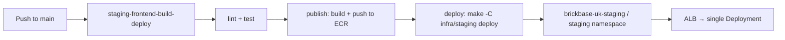
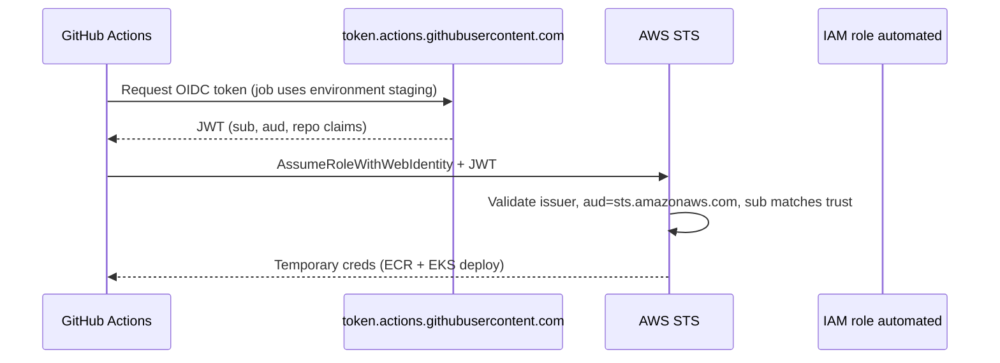
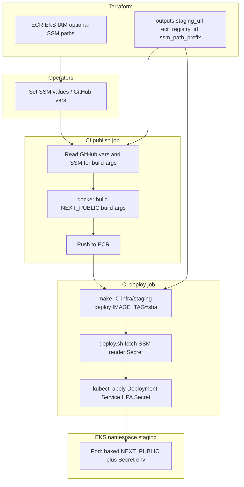

# PRD: AWS Services for Brickbase Staging (Terraform)

## Objective

Provision the AWS infrastructure required to run the Brickbase frontend container pipeline end-to-end in a **single staging environment**:

1. Build and push a Docker image to ECR on CI.
2. Deploy that image to one EKS cluster via `kubectl apply`.
3. Expose the application over HTTPS through an ALB.

This PRD defines what Terraform must create and [how it is executed](#terraform-execution). Application CI (`.github/workflows/staging-frontend-build-deploy.yml`, `Dockerfile`, `infra/staging/Makefile`) is committed in the same repo; operators complete [one-time setup](#one-time-setup-before-first-push-deploy) after the first `terraform apply`.

## Scope

### In scope

- One AWS region: **eu-west-2** (London).
- One ECR repository: **`brickbase-frontend`**.
- One EKS cluster: **`brickbase-uk-staging`**.
- One Kubernetes namespace: **`staging`**.
- One frontend Deployment.
- CI-driven deploy from **`.github/workflows/staging-frontend-build-deploy.yml`** after image publish 
- Supporting networking, IAM, load balancing, and TLS **references** for a single staging hostname (DNS zone, hostname records, and ACM cert are **operator-managed**, not created by Terraform).
- Bootstrap Kubernetes components required by the existing deploy manifest pattern (Service, Deployment, HPA).

### Out of scope

- **Provisioning production** infrastructure (cluster, ECR, Route 53 for prod) in this PRD — production Terraform and workflows are a **follow-up**.
- **`production-frontend-release-deploy.yml`** and production deploy automation (until a dedicated production story).
- Multi-region or multi-cluster topology.

**In scope for configuration design:** Patterns in [Configuration and secrets](#configuration-and-secrets-multi-environment) must be **environment-parameterized** so **production can reuse the same key names and tooling with different values** (separate SSM prefix, hostname, GitHub Environment, and image build-args) without redesign.

### Out of scope (unchanged)

- Backend API, RDS, S3 asset buckets, analytics (Matomo), or other application dependencies.
- Feature-branch ephemeral namespaces and teardown workflows.
- Application refactors to remove site variables from the codebase (noted as a dependency, not part of Terraform).

## Target deployment model

### CI/CD flow

**Workflow:** `.github/workflows/staging-frontend-build-deploy.yml` — **trigger:** push to **`main`**.



Job details, deploy invocation, and GitHub Environment variables: [GitHub Actions integration](#github-actions-integration). Operator bootstrap before the first run: [One-time setup before first push deploy](#one-time-setup-before-first-push-deploy).

**Out of scope for CI:** `production-frontend-release-deploy.yml`, release-based production deploy, `terraform apply` / `terraform destroy`.

### Runtime identity (single app)

| Setting | Value |
|---------|-------|
| ECR repository | `brickbase-frontend` |
| Image tag | Git commit SHA (`${{ github.sha }}`) |
| EKS cluster / namespace / app | `brickbase-uk-staging` / `staging` / `brickbase-frontend` |
| Region | `eu-west-2` |
| `NODE_ENV` at deploy | `staging` |

Deploy Makefile defaults and overrides: [Deploy tooling](#deploy-tooling). HPA bounds are set at deploy time via `HPA_MIN` / `HPA_MAX` (see `infra/staging/Makefile`).

### URLs and DNS (staging)

Operators must choose **`staging_hostname`** before `terraform apply`. All browser-facing and build-time URL configuration derives from it.

#### Canonical public URL

| Name | Formula / value | Used by |
|------|-----------------|---------|
| **`staging_hostname`** | Pre-existing FQDN (variable only; no scheme) | Ingress `host`, CI `NEXT_PUBLIC_APP_URL`, outputs |
| **`staging_url`** | `https://${staging_hostname}` | Public browser URL; smoke tests; **`NEXT_PUBLIC_APP_URL`** at image build |
| **ALB DNS** | Terraform output `alb_dns_name` | Debugging only — **do not** use in app env vars or WalletConnect config |

#### What is the ALB?

An **Application Load Balancer (ALB)** is AWS’s layer-7 load balancer in front of EKS. It receives **HTTP/HTTPS** from the internet, terminates **TLS** (using the ACM certificate for `staging_hostname`), and forwards traffic to healthy **Kubernetes pods** on the node group. The **AWS Load Balancer Controller** watches Ingress resources and creates/updates the ALB automatically.

The ALB gets an AWS-assigned DNS name (e.g. `k8s-staging-brickbase-a1b2c3d4.eu-west-2.elb.amazonaws.com`). That name is **not** the app’s product URL — it is the load balancer’s infrastructure endpoint.

**Do not confuse with the EKS cluster URL** (`*.eks.amazonaws.com`): that endpoint is for the **Kubernetes API** (`kubectl`, CI deploy) only. Browsers never use it to load the Next.js app.

#### ALB-only smoke test vs canonical URL

| Approach | URL example | Valid for | Limitations |
|----------|-------------|-----------|-------------|
| **ALB-only smoke test** | `https://k8s-staging-….elb.amazonaws.com` or `curl` with `-H "Host: briqbase.com"` | Ops checking that pods, Service, Ingress, and ALB wiring work | ACM cert is for `staging_hostname`, **not** the ALB name → browser HTTPS warnings; Ingress may reject requests without the correct `Host` header; **not** suitable for WalletConnect or live WebSockets |
| **Canonical URL** (required for real staging) | `https://briqbase.com` (`staging_url`) | Users, wallets, CI acceptance tests, `NEXT_PUBLIC_APP_URL` | Needs **operator-managed** Route 53 alias + issued ACM cert + image built with matching `NEXT_PUBLIC_APP_URL` |

**Guidance:** Use **`staging_url`** for all product and CI acceptance tests. Use **`alb_dns_name`** only for infrastructure debugging (e.g. confirm the ALB exists, check target group health) — never bake the ALB hostname into the Docker image or WalletConnect config.

**Example (placeholder until a real domain is chosen):**

| Setting | Example value |
|---------|---------------|
| `staging_hostname` | `briqbase.com` |
| `staging_url` | `https://briqbase.com` |

**Rules:**

- **`staging_url` uses HTTPS** (port 443 via ALB). Do not expose the app on raw node port 3000 to the internet.
- **`NEXT_PUBLIC_APP_URL` must equal `staging_url`** (same scheme and host, no trailing slash) when building the Docker image in CI.
- **`GATEWAY_ALLOWED_ORIGINS`** (events gateway, when deployed) must include `staging_url` so the browser WebSocket origin is allowed — see [prd-pub-sub.md](./prd-pub-sub.md).
- **`NEXT_PUBLIC_WS_LIVE_URL`** (when live feeds run in staging) must use **`wss://`** and point at the gateway host, e.g. `wss://${staging_hostname}/ws/live` if the gateway shares the same hostname via Ingress, or a dedicated host such as `wss://gateway.staging.brickbase.example.com/ws/live`.

#### DNS and TLS flow

```
staging_hostname  →  Route 53 alias A/AAAA (operator)  →  ALB (HTTPS :443)  →  Ingress host: staging_hostname  →  Service :80  →  Pod :3000
```

| Step | Owner | Requirement |
|------|-------|-------------|
| Hosted zone | **Operator** (pre-existing) | Route 53 zone already contains `staging_hostname` |
| ACM | **Operator** (pre-existing) | Issued certificate in **eu-west-2** for `staging_hostname`; ARN passed as `acm_certificate_arn` |
| Route 53 alias | **Operator** (after apply) | `staging_hostname` → ALB (`terraform output alb_dns_name`) |
| Ingress | **Terraform** | `host` = `staging_hostname`; TLS at ALB via `acm_certificate_arn` |

**Terraform does not create:** Route 53 hosted zones, hostname DNS records, ACM certificates, or ACM validation records.

#### Build-time and runtime config

Client (`NEXT_PUBLIC_*`) and server env vars are set at **docker build** and **deploy** respectively. Storage paths per layer (local, staging, production): [Configuration and secrets](#configuration-and-secrets-multi-environment).

#### Local development (reference)

| Environment | Web URL                 | Notes |
|-------------|-------------------------|-------|
| Local       | `http://localhost:3000` | `nx run web:serve`; see root `.env.example` |
| Staging     | `https://${staging_hostname}` | This PRD |

#### Terraform contract for URLs

See variables `staging_hostname`, `acm_certificate_arn` and outputs `staging_hostname`, `staging_url`, `alb_dns_name` in [Variables](#variables-terraform) and [Outputs](#outputs-terraform).

## Architecture

```
Internet
   │
   ▼
Route 53 (staging hostname)
   │
   ▼
ACM certificate (HTTPS)
   │
   ▼
Application Load Balancer (internet-facing)
   │  AWS Load Balancer Controller (Ingress)
   ▼
EKS: brickbase-uk-staging
   └── namespace: staging
         ├── Deployment: brickbase-frontend  (pods pull from ECR)
         ├── Service: NodePort 80 → 3000
         └── HPA: CPU 50% target
```

## AWS services to provision (Terraform)

### 1. Amazon ECR

| Resource               | Specification         |
|------------------------|-----------------------|
| Repository name        | `brickbase-frontend`  |
| Region                 | `eu-west-2`           |
| Image tag immutability | Recommended: enabled for SHA tags |
| Scan on push           | Recommended: enabled |
| Lifecycle policy       | Optional: expire untagged images after N days |

**Outputs required:** repository URL, registry ID, ARN.

### 2. VPC and networking

EKS requires a dedicated VPC layout. Terraform should either **create** a new VPC or **consume** an existing one via variables (document which approach is chosen in the Terraform README when implemented).

| Resource           | Specification           |
|--------------------|-------------------------|
| VPC                | `/16` CIDR; tagged `project=brickbase`, `environment=staging` |
| Subnets            | Minimum 2 AZs: private subnets for nodes, public subnets for ALB |
| Internet Gateway   | Attached to VPC |
| NAT Gateway        | At least one per AZ (or one shared for cost — document trade-off) |
| Route tables       | Public routes to IGW; private routes to NAT |
| Security groups    | Cluster SG, node SG, ALB SG with least-privilege rules |

**Outputs required:** VPC ID, private subnet IDs, public subnet IDs, relevant security group IDs.

### 3. Amazon EKS

| Resource     | Specification             |
|--------------|---------------------------|
| Cluster name | `brickbase-uk-staging`    |
| Region       | `eu-west-2`               |
| Kubernetes version | Supported EKS version at implementation time (≥ 1.30 recommended for kubectl parity) |
| Endpoint access | Private + public (public required for GitHub Actions `kubectl` unless a self-hosted runner in-VPC is added later) |
| Cluster IAM role | Standard EKS cluster service role |
| Cluster security group | As per VPC module |
| Enabled add-ons | `vpc-cni`, `coredns`, `kube-proxy`; `aws-ebs-csi-driver` if PVCs are needed later |
| Control plane logging | Optional: `api`, `audit`, `authenticator` → CloudWatch |

**Outputs required:** cluster name, endpoint, OIDC issuer URL, cluster ARN.

### 4. EKS managed node group

| Resource | Specification |
|----------|---------------|
| Name     | `brickbase-uk-staging-default`|
| Instance types | Parameterised; default e.g. `t3.medium` (sufficient for 2–4 frontend pods) |
| Scaling | Min 2, max 4 nodes (align with HPA max replicas + headroom) |
| Subnets | Private subnets only |
| Node IAM role | With `AmazonEKSWorkerNodePolicy`, `AmazonEKS_CNI_Policy`, `AmazonEC2ContainerRegistryReadOnly` |
| Labels | `environment=staging`, `project=brickbase` |

### 5. IAM

#### 5.1 CI/CD role: `automated`

Used by GitHub Actions to assume AWS credentials, push to ECR, and run `kubectl` against the cluster.

| Permission area | Required actions |
|-----------------|------------------|
| ECR             | `GetAuthorizationToken`, push/pull on `brickbase-frontend` |
| EKS             | `DescribeCluster`, `ListClusters`; access via `aws eks update-kubeconfig` |
| Kubernetes API  | Deploy/update resources in namespace `staging` (via EKS access entry or `aws-auth` mapping) |

**Trust policy:** GitHub Actions OIDC (preferred) or IAM user access key (fallback). Operator setup: [Step 2](#step-2--one-time-aws-setup-github-oidc-for-ci).

**Output required:** `automated_role_arn` — see [Outputs (Terraform)](#outputs-terraform).

#### 5.2 EKS access for CI role

Map the `automated` role to a Kubernetes RBAC role that can:

- `kubectl apply` Deployment, Service, HPA in namespace `staging`
- `kubectl rollout status` on Deployment `brickbase-frontend`
- Create namespace `staging` on first deploy (or pre-create via Terraform)

Use **EKS access entries** (modern) or **`aws-auth` ConfigMap** (legacy) — pick one approach in implementation.

#### 5.3 IRSA: AWS Load Balancer Controller

| Resource                  | Purpose                                           |
|---------------------------|---------------------------------------------------|
| IAM OIDC provider         | Linked to EKS OIDC issuer                         |
| IAM role + policy         | ALB create/manage permissions for the controller  |
| Kubernetes ServiceAccount | `kube-system/aws-load-balancer-controller`        |

### 6. Elastic Load Balancing (ALB)

Provisioned by the **AWS Load Balancer Controller** when Ingress is applied — Terraform should install the controller Helm release (or equivalent) and its IAM dependencies.

| Setting        | Value                                         |
|----------------|-----------------------------------------------|
| Scheme         | Internet-facing                               |
| Target type    | `instance` (matches existing ingress pattern) |
| Listeners      | HTTP 80 → HTTPS redirect; HTTPS 443           |
| Ingress class  | `alb`                                         |

Terraform may also manage a **baseline Ingress** template for staging (hostname parameterised), or leave Ingress to the application deploy step — document the chosen split in implementation.

### 7. DNS and TLS (operator-managed — not created by Terraform)

| Concern | Owner | Notes |
|---------|-------|-------|
| Route 53 hosted zone | Operator | Pre-existing; Terraform does **not** create zones |
| `staging_hostname` DNS | Operator | After apply, alias `A`/`AAAA` from `staging_hostname` → `terraform output alb_dns_name` |
| ACM certificate | Operator | Pre-existing, **Issued**, in **eu-west-2** for `staging_hostname` |
| Ingress TLS | Terraform | Uses `acm_certificate_arn` variable on the ALB Ingress annotation |

**Variables required:** `staging_hostname`, `acm_certificate_arn`.

### 8. Kubernetes bootstrap (via Terraform Kubernetes/Helm providers)

These are not separate AWS products but must exist before **`make -C infra/staging deploy`** succeeds.

| Component                     | Namespace | Notes |
|-------------------------------|-----------|----------------------------------------|
| Namespace `staging`           | —         | Pre-created by Terraform recommended   |
| Metrics Server | `kube-system` | Required for CPU-based HPA in `deploy.tmpl.yaml`  |
| AWS Load Balancer Controller  | `kube-system` | Required for public HTTPS          |
| Optional: Ingress             | `staging` | If not managed by the deploy step      |

**Not created by Terraform (application deploy):** Deployment, Service, HPA for `brickbase-frontend` — applied by `staging-frontend-build-deploy.yml` via **`make -C infra/staging deploy`** unless explicitly moved into Terraform later.

### 9. Observability (recommended)

| Resource             | Specification |
|----------------------|---------------|
| CloudWatch log group | `/aws/eks/brickbase-uk-staging/cluster` |
| Container Insights   | Optional addon |

## Terraform project structure (recommended)

```
infra/
  staging/
    README.md                 # apply/destroy instructions, backend config
    versions.tf               # provider pins
    providers.tf              # aws, kubernetes, helm
    variables.tf
    outputs.tf
    backend.tf                # S3 remote state (see below)
    ecr.tf
    vpc.tf                    # or data sources if using shared VPC
    eks.tf
    node_group.tf
    iam_ci.tf
    iam_alb_controller.tf
    oidc.tf
    acm.tf                    # data source: validates operator-provided acm_certificate_arn
    ssm.tf                    # SSM path placeholders; output ssm_path_prefix
    k8s_namespace.tf          # staging namespace (flat k8s_*.tf — Terraform root module only)
    k8s_metrics_server.tf     # metrics-server Helm release (HPA)
    k8s_alb_controller.tf     # AWS Load Balancer Controller
    k8s_ingress.tf            # baseline Ingress → ALB
    policies/                 # IAM policy JSON (e.g. ALB controller)
    Makefile                  # deploy entrypoint (CI + local)
    deploy.sh                 # called by Makefile targets
    deploy.tmpl.yaml          # Kubernetes manifest template
    .env.staging.example      # variable defaults / Terraform output mapping
  Dockerfile                  # Next.js image; NEXT_PUBLIC_* build-args in CI
  .dockerignore
.github/workflows/
  staging-frontend-build-deploy.yml   # push to main → lint, test, ECR, make deploy
```

### Remote state

| Resource       | Purpose                 | MVP |
|----------------|-------------------------|-----|
| S3 bucket      | Terraform state storage | **Yes** — implement |
| DynamoDB table | State locking (concurrent `plan`/`apply`) | **No** — document only; add later if multiple operators or CI `terraform plan` |

**MVP:** `backend.tf` uses the **S3 backend only** (no `dynamodb_table`). Single-operator manual `apply` does not require locking.

**Optional follow-up:** If a second operator or CI runs Terraform against the same state, add a DynamoDB lock table and set `dynamodb_table` in `backend.tf` per [Terraform S3 backend docs](https://developer.hashicorp.com/terraform/language/settings/backends/s3).

Bootstrap resources may live in a separate bootstrap stack or the same account; document the bootstrap process in `infra/staging/README.md` when implemented.

## Variables (Terraform)

| Variable              | Description               | Example                |
|-----------------------|---------------------------|------------------------|
| `aws_region`          | Deployment region         | `eu-west-2`            |
| `project_name`        | Resource naming prefix    | `brickbase`            |
| `environment`         | Environment label         | `staging`              |
| `cluster_name`        | EKS cluster name          | `brickbase-uk-staging` |
| `ecr_repository_name` | ECR repo name             | `brickbase-frontend`   |
| `staging_hostname`    | Pre-existing public DNS name (FQDN, no scheme); Ingress host only — no DNS records created | `briqbase.com` |
| `acm_certificate_arn` | Pre-existing **Issued** ACM cert ARN (eu-west-2) for `staging_hostname` | `arn:aws:acm:eu-west-2:…:certificate/…` |
| `vpc_cidr`            | VPC CIDR if creating VPC  | `10.20.0.0/16`         |
| `node_instance_types` | EKS node types            | `["t3.medium"]`        |
| `node_min_size`       | Node group minimum        | `2`                    |
| `node_max_size`       | Node group maximum        | `4`                    |
| `kubernetes_version`  | EKS version               | `1.30`                 |
| `github_oidc_provider_arn` | GitHub Actions OIDC provider ARN (one-time per account); `null` disables OIDC trust | `arn:aws:iam::<account-id>:oidc-provider/token.actions.githubusercontent.com` |
| `github_oidc_subjects` | JWT `sub` claims allowed to assume `automated` role | `["repo:<org>/brickbase:environment:staging"]` — required because CI jobs use `environment: staging`; see [Step 2](#step-2--one-time-aws-setup-github-oidc-for-ci) |
| `automated_trust_principal_arns` | IAM user/role ARNs for `sts:AssumeRole` (key-based CI fallback) | `[]` when using OIDC only |
| `tags`  | Common resource tags | `{ Project = "brickbase", Environment = "staging" }` |

## Outputs (Terraform)

| Output                 | Consumer                         |
|------------------------|----------------------------------|
| `ecr_repository_url`   | `staging-frontend-build-deploy.yml`, `infra/staging/Makefile` |
| `ecr_registry_id`      | CI, Makefile default `IMAGE_ACC` |
| `eks_cluster_name`     | `staging-frontend-build-deploy.yml` deploy job |
| `eks_cluster_endpoint` | Debugging, kubectl               |
| `automated_role_arn`   | GitHub Actions `ARN` env var     |
| `staging_namespace`    | Deploy job (`staging`)           |
| `staging_hostname`     | Ingress host, ACM cert, CI build-args |
| `staging_url`          | `https://${staging_hostname}` — app URL, smoke tests, `NEXT_PUBLIC_APP_URL` |
| `ssm_path_prefix`      | `/brickbase/staging` — Makefile, `deploy.sh`, operator runbook |
| `alb_dns_name`         | ALB hostname; debugging only (not for app config) |

## Terraform execution

Terraform provisions **AWS and cluster bootstrap** resources. It is **separate** from the application pipeline (`staging-frontend-build-deploy.yml`). Infra changes are **infrequent**; app deploys are **on every push**.

### Who runs Terraform

| Actor                          | Runs                | Does not run |
|--------------------------------|---------------------|--------------|
| **Platform / DevOps operator** | `terraform init`, `plan`, `apply`, `destroy` (staging stack) | Application Docker build or `make deploy` |
| **GitHub Actions** (`staging-frontend-build-deploy.yml`) | ECR push, `make -C infra/staging deploy` | **`terraform apply`** (MVP) |
| **Developers**                | Local app dev (`.env`) | Terraform apply unless explicitly granted AWS infra admin |

**MVP:** **`terraform apply` is manual** (operator workstation or approved break-glass CI job). Optional follow-up: GitHub Actions **`terraform plan` on PR**; **`apply` on merge** to an `infra` branch — not required for initial staging.

### Prerequisites

| Requirement     | Notes                             |
|--------------------|--------------------------------|
| Terraform CLI      | `>= 1.5` (match `versions.tf`) |
| AWS credentials    | IAM user **`brickbase`** via `~/.aws/credentials` profile (see [Operator AWS credentials](#operator-aws-credentials)); not the CI `automated` role |
| `terraform.tfvars` | Create locally (**gitignored**); set `staging_hostname`, `acm_certificate_arn`, CI trust ARNs — see `terraform.tfvars.example` |
| Remote backend     | S3 state bucket (bootstrap step below); no DynamoDB in MVP |

The CI **`automated`** IAM role (Terraform output) is for **deploy** (ECR + kubectl). It is **not** assumed to be the Terraform admin principal unless explicitly designed that way (see [Risks and decisions](#risks-and-decisions)).

### Operator AWS credentials

Terraform does **not** select an IAM user by name. The AWS provider uses whatever credentials are active in the operator shell (profile, env vars, or role).

**One-time setup** (operator workstation):

1. In AWS Console: **IAM → Users → `brickbase` → Security credentials → Create access key**.
2. Configure a local profile (creates or updates `~/.aws/credentials` and `~/.aws/config`):

```bash
aws configure --profile brickbase
# Access key, secret key, region: eu-west-2, output: json
```

Or edit `~/.aws/credentials` manually (`chmod 600`). Do **not** commit credentials to the repo.

**Before every Terraform session** — select the profile and confirm identity:

```bash
export AWS_PROFILE=brickbase
aws sts get-caller-identity
```

Expected `Arn`: `arn:aws:iam::<account-id>:user/brickbase`. If the ARN differs, stop — wrong credentials (often `[default]`). Fix `AWS_PROFILE` or keys before `terraform plan` / `apply`.

### Execution model (two phases)

```text
Phase A — Bootstrap (once per account/region, or use existing org bucket)
Phase B — Staging stack (infra/staging/, repeat when infra changes)
         ↓
Operator bootstrap: SSM values, GitHub Environment vars
         ↓
Application CI: build image → make deploy (no terraform)
```

### Phase A — Bootstrap remote state (once)

Run **before** the main staging stack if no shared state bucket exists:

1. Apply bootstrap (`infra/staging/bootstrap/`) or create manually: S3 state bucket `brickbase` (versioning, encryption). **Do not** create a DynamoDB lock table for MVP.
2. `backend.tf` is committed under `infra/staging/`; create `terraform.tfvars` locally (gitignored) — see `terraform.tfvars.example` for variable names.
3. Document bucket name and state key in `infra/staging/README.md`.

Bootstrap may use **local state** temporarily; main stack must use the **remote backend** before team-wide applies.

### Phase B — Staging stack (operator commands)

Working directory: **`infra/staging/`**

```bash
cd infra/staging

# Required: use Terraform operator identity (not CI automated role)
export AWS_PROFILE=brickbase
aws sts get-caller-identity   # expect ...:user/brickbase

# terraform.tfvars must exist locally (gitignored; see terraform.tfvars.example)

terraform init
terraform fmt -recursive
terraform validate
terraform plan -out=tfplan

# Review plan, then:
terraform apply tfplan

# Record outputs for CI, Makefile, and runbook
terraform output
terraform output -json > ../../docs/staging-terraform-outputs.json   # optional local artifact; do not commit secrets
```

**Typical first apply creates:** VPC, ECR, EKS cluster + node group, IAM (including `automated` role), Ingress → ALB, SSM path placeholders, Kubernetes namespace and add-ons (Metrics Server, ALB controller). **Does not create:** Route 53 zones/records, ACM certificates.

**Providers:** AWS, Kubernetes, and Helm run in the **same** apply. Kubernetes/Helm resources depend on EKS API availability (use explicit `depends_on` in implementation).

### When to re-run Terraform

| Trigger                        | Action                                         |
|--------------------------------|------------------------------------------------|
| New staging infra (greenfield) | Full `terraform apply` per [implementation order](#implementation-order) |
| Change VPC, cluster size, Ingress/ALB, new SSM paths | `terraform plan` → `apply`  |
| DNS alias or ACM cert rotation | **Operator** — update Route 53 / ACM outside Terraform; re-apply only if `acm_certificate_arn` changes |
| App code or Docker image only  | **No** Terraform — use CI `publish` + `make deploy` |
| SSM **secret value** rotation  | **No** Terraform — operator updates SSM + `make deploy` |
| Tear down staging | `terraform destroy` (see cautions below) |

### Validation (local and optional CI)

| Check           | Command                         |
|-----------------|---------------------------------|
| AWS identity    | `export AWS_PROFILE=brickbase && aws sts get-caller-identity` |
| Format          | `terraform fmt -check -recursive infra/staging` |
| Validate        | `cd infra/staging && terraform init -backend=false && terraform validate` |
| Plan (no apply) | `export AWS_PROFILE=brickbase && cd infra/staging && terraform plan` |

Optional: add a GitHub workflow on PRs that touch `infra/staging/**` running **fmt + validate + plan** only (no apply).

### One-time setup before first push deploy

Complete these steps **once** after [Phase B — Staging stack](#phase-b--staging-stack-operator-commands) succeeds. Until they are done, pushes to `main` will fail in the `publish` or `deploy` job (missing GitHub vars, OIDC trust, or SSM values).

**Prerequisites:** Terraform staging stack applied; `terraform output` shows healthy cluster, ECR, and `staging_url`.

#### Step 1 — Verify infrastructure (operator)

Run locally with the Terraform operator identity (`AWS_PROFILE=brickbase`):

```bash
export AWS_PROFILE=brickbase
aws sts get-caller-identity

cd infra/staging
terraform output

# ECR accepts images
aws ecr describe-repositories --repository-names brickbase-frontend --region eu-west-2

# Cluster is ACTIVE and nodes are Ready
aws eks describe-cluster --name brickbase-uk-staging --region eu-west-2 --query 'cluster.status'
kubectl get nodes   # after: aws eks update-kubeconfig --region eu-west-2 --name brickbase-uk-staging

# Bootstrap pods healthy
kubectl get pods -n kube-system | grep -E 'metrics-server|aws-load-balancer-controller'

# Staging URL responds (may 502 until first app deploy)
curl -I "$(terraform output -raw staging_url)"
```

Record outputs for step 3 — see [Outputs (Terraform)](#outputs-terraform). Minimum for GitHub Environment **`staging`**: `ecr_registry_id` → `ECR_REGISTRY_ID`, `automated_role_arn` → `AUTOMATED_ROLE_ARN`, `staging_url` → `NEXT_PUBLIC_APP_URL`.

#### Step 2 — One-time AWS setup (GitHub OIDC for CI)

GitHub Actions must authenticate to AWS to push images and run `kubectl`. **OIDC** (OpenID Connect) lets each workflow run obtain **short-lived** AWS credentials by assuming the Terraform-created **`automated`** IAM role — without storing long-lived `AWS_ACCESS_KEY_ID` / `AWS_SECRET_ACCESS_KEY` in GitHub.



**Do not confuse two different OIDC providers in this stack:**

| Provider | Purpose | Created by |
|----------|---------|------------|
| **GitHub Actions OIDC** (`token.actions.githubusercontent.com`) | CI assumes `automated` role | **Operator — one-time per AWS account** (this step) |
| **EKS cluster OIDC** (issuer URL on the cluster) | IRSA for in-cluster pods (e.g. ALB controller) | **Terraform** (`module.eks`) — no manual step |

##### 2a. Prerequisites

```bash
export AWS_PROFILE=brickbase
aws sts get-caller-identity
# Note Account — used in ARNs below
```

Replace placeholders in all commands:

| Placeholder | Example |
|-------------|---------|
| `<account-id>` | `123456789012` from `get-caller-identity` |
| `<github-org>` | GitHub org or user that owns the repo |
| `<repo>` | `brickbase` |

##### 2b. Create the GitHub OIDC identity provider (once per AWS account)

Check whether it already exists:

```bash
aws iam list-open-id-connect-providers
# Look for: .../oidc-provider/token.actions.githubusercontent.com
```

**If missing**, create it.

**Option A — AWS CLI (recommended):**

```bash
aws iam create-open-id-connect-provider \
  --url https://token.actions.githubusercontent.com \
  --client-id-list sts.amazonaws.com \
  --thumbprint-list 6938fd4d98bab03fa8868472d86595d82c2748fe
```

**Option B — AWS Console:**

1. IAM → **Identity providers** → **Add provider**.
2. Provider type: **OpenID Connect**.
3. Provider URL: `https://token.actions.githubusercontent.com`
4. Audience: `sts.amazonaws.com`
5. Add provider (accept default thumbprint if prompted).

**Record the provider ARN** (fixed format per account):

```text
arn:aws:iam::<account-id>:oidc-provider/token.actions.githubusercontent.com
```

Verify:

```bash
aws iam get-open-id-connect-provider \
  --open-id-connect-provider-arn "arn:aws:iam::<account-id>:oidc-provider/token.actions.githubusercontent.com"
```

##### 2c. Configure `automated` role trust in Terraform

Edit `infra/staging/terraform.tfvars` (local, gitignored). Set OIDC trust for the **`publish`** and **`deploy`** jobs, which use `environment: staging` in `.github/workflows/staging-frontend-build-deploy.yml`.

The IAM trust policy matches the JWT **`sub`** (subject) claim. For jobs with `environment: staging`, GitHub emits:

```text
repo:<github-org>/brickbase:environment:staging
```

**Required `terraform.tfvars` values:**

```hcl
automated_trust_principal_arns = []   # leave empty when using OIDC only

github_oidc_provider_arn = "arn:aws:iam::<account-id>:oidc-provider/token.actions.githubusercontent.com"
github_oidc_subjects = [
  "repo:<github-org>/brickbase:environment:staging",
]
```

**Optional:** also allow branch-based subjects (only needed if a job assumes AWS **without** `environment: staging`):

```hcl
github_oidc_subjects = [
  "repo:<github-org>/brickbase:environment:staging",
  "repo:<github-org>/brickbase:ref:refs/heads/main",
]
```

See `infra/staging/terraform.tfvars.example` for commented examples.

Apply the trust policy update:

```bash
cd infra/staging
export AWS_PROFILE=brickbase
terraform plan -out=tfplan
# Confirm: aws_iam_role.automated trust policy adds AssumeRoleWithWebIdentity for the GitHub OIDC provider
terraform apply tfplan
terraform output -raw automated_role_arn
```

##### 2d. Verify IAM role trust and permissions

```bash
# Trust policy includes GitHub OIDC provider + sub condition
aws iam get-role --role-name automated --query 'Role.AssumeRolePolicyDocument'

# Role policies: ECR push, EKS describe, SSM read under /brickbase/staging/
aws iam list-role-policies --role-name automated

# EKS access entry for namespace staging (AmazonEKSEditPolicy)
aws eks list-access-entries --cluster-name brickbase-uk-staging --region eu-west-2
```

Expected trust policy elements:

| Element | Value |
|---------|-------|
| Action | `sts:AssumeRoleWithWebIdentity` |
| Principal | `arn:aws:iam::<account-id>:oidc-provider/token.actions.githubusercontent.com` |
| Condition `StringEquals` | `token.actions.githubusercontent.com:aud` = `sts.amazonaws.com` |
| Condition `StringLike` | `token.actions.githubusercontent.com:sub` matches `github_oidc_subjects` |

##### 2e. GitHub repository settings (OIDC token issuance)

In the GitHub repo → **Settings → Actions → General**:

| Setting | Value |
|---------|-------|
| **Workflow permissions** | *Read repository contents permission* (sufficient for this workflow) |
| **Allow GitHub Actions to create and approve pull requests** | Off (not required) |

The workflow already requests OIDC tokens via:

```yaml
permissions:
  contents: read
  id-token: write   # required for configure-aws-credentials + role-to-assume
```

No AWS access keys are stored in GitHub when OIDC is configured.

##### 2f. Smoke-test OIDC (first push to `main`)

OIDC role assumption is exercised only inside GitHub Actions. After steps 2b–2e and GitHub Environment vars (step 3):

1. Push to **`main`** (or re-run the failed workflow).
2. In **`publish`** and **`deploy`**, confirm **Configure AWS credentials** succeeds.
3. If it fails with `Not authorized to perform sts:AssumeRoleWithWebIdentity`, check [Troubleshooting](#oidc-troubleshooting).

<a id="oidc-troubleshooting"></a>

**OIDC troubleshooting:**

| Symptom | Likely cause | Fix |
|---------|--------------|-----|
| `Not authorized to perform sts:AssumeRoleWithWebIdentity` | Wrong `sub` in `github_oidc_subjects` | Use `repo:<org>/brickbase:environment:staging` (workflow uses `environment: staging`) |
| Same error | OIDC provider not created | Run [2b](#2b-create-the-github-oidc-identity-provider-once-per-aws-account) |
| Same error | `github_oidc_provider_arn` null or wrong account | Set ARN in `terraform.tfvars` and re-apply |
| `AccessDenied` on ECR/EKS after assume-role succeeds | Role policies or EKS access entry | Re-run Terraform; verify [2d](#2d-verify-iam-role-trust-and-permissions) |
| `id-token: write` permission error | Workflow permissions | Add `id-token: write` under top-level `permissions` (already in repo workflow) |

##### 2g. Alternative — long-lived IAM user keys (not recommended)

If OIDC cannot be used:

1. Create an IAM user (e.g. `github-ci`) with programmatic access.
2. In `terraform.tfvars`:

```hcl
github_oidc_provider_arn = null
github_oidc_subjects     = []
automated_trust_principal_arns = ["arn:aws:iam::<account-id>:user/github-ci"]
```

3. Re-apply Terraform.
4. Store `AWS_ACCESS_KEY_ID` and `AWS_SECRET_ACCESS_KEY` in GitHub Environment **`staging`** secrets.
5. Change `.github/workflows/staging-frontend-build-deploy.yml` to use key-based `aws-actions/configure-aws-credentials` (`aws-access-key-id` / `aws-secret-access-key`) instead of `role-to-assume`.

Prefer OIDC for ongoing deployments triggered by pushes to `main`.

#### Step 3 — Create GitHub Environment `staging`

Repo → **Settings → Environments → New environment** → name: **`staging`**.

Add **variables** (non-secret):

| GitHub variable | Value source | Notes |
|-----------------|--------------|-------|
| `ECR_REGISTRY_ID` | `terraform output -raw ecr_registry_id` | 12-digit AWS account ID |
| `AUTOMATED_ROLE_ARN` | `terraform output -raw automated_role_arn` | CI assumes this role via OIDC |
| `NEXT_PUBLIC_APP_URL` | `terraform output -raw staging_url` | Must equal `https://${staging_hostname}` |
| `NEXT_PUBLIC_CHAIN_ID` | Operator choice (e.g. `11155111` Sepolia) | Baked into image at build |
| `NEXT_PUBLIC_RPC_URL` | Staging RPC HTTPS URL | Baked into image at build |
| `NEXT_PUBLIC_ASSET_VAULT_ADDRESS` | Deployed contract on staging chain | |
| `NEXT_PUBLIC_ASSET_SHARES_ADDRESS` | Deployed contract on staging chain | |
| `NEXT_PUBLIC_ORACLE_ROUTER_ADDRESS` | Deployed contract on staging chain | |
| `NEXT_PUBLIC_USER_ALLOWLIST_ADDRESS` | Deployed contract on staging chain | |
| `NEXT_PUBLIC_USDC_ADDRESS` | Deployed contract on staging chain | |
| `NEXT_PUBLIC_WS_LIVE_URL` | Optional; e.g. `wss://${staging_hostname}/ws/live` | When live feeds run in staging |

Add **secrets** (sensitive build-time values):

| GitHub secret | Purpose |
|---------------|---------|
| `NEXT_PUBLIC_WALLETCONNECT_PROJECT_ID` | WalletConnect Cloud project ID (Docker build-arg) |

Optional repo-level secret (only if using private npm packages in Docker build):

| Secret | Purpose |
|--------|---------|
| `NODE_MODULE_TOKEN` | GitHub PAT or npm token for `npm ci` in Dockerfile |

**Do not** store deploy-only vars (`IMAGE_TAG`, `CLUSTER`, etc.) in GitHub unless overriding Makefile defaults. The workflow passes `IMAGE_TAG=${{ github.sha }}` and `IMAGE_ACC` from `ECR_REGISTRY_ID` per run.

#### Step 4 — Bootstrap SSM parameters (server-side runtime)

Replace Terraform placeholders (`CHANGE_ME`) under `/brickbase/staging/*` with real values. Path list, IAM, and example commands: [SSM Parameter Store layout](#ssm-parameter-store-layout). `deploy.sh` skips parameters still set to `CHANGE_ME`.

#### Step 5 — Optional local deploy config

For manual deploys from a laptop (not used by CI): copy `infra/staging/.env.staging.example` → `.env.staging` and set `IMAGE_ACC` from `terraform output -raw ecr_registry_id`.

#### Step 6 — First push deploy and smoke test

1. Push to **`main`** (workflow runs lint → test → publish → deploy; does **not** run `terraform apply`).
2. In GitHub Actions, confirm all jobs succeed.
3. Verify rollout: `kubectl rollout status deployment/brickbase-frontend -n staging`
4. Browse **`staging_url`** over HTTPS; confirm `NEXT_PUBLIC_APP_URL` matches `staging_url`.

**Ongoing deploys:** every subsequent push to `main` repeats the above. Update GitHub vars / SSM when config changes; re-run Terraform only for infra changes.

### What application CI must not do (MVP)

See [GitHub Actions integration](#github-actions-integration). Additionally: do not store Terraform state in the app repo or commit `terraform.tfvars`.

### Destroy

`terraform destroy` in `infra/staging/` removes staging AWS resources (EC2 nodes, EKS, ECR repo if managed, etc.). **State bucket** is usually retained. Document destroy order and data loss (ECR images, etc.) in `infra/staging/README.md`. Application CI must never run destroy.

## GitHub Actions integration

**Workflow:** `.github/workflows/staging-frontend-build-deploy.yml` (committed). **Trigger:** push to **`main`**. **AWS auth:** OIDC via `vars.AUTOMATED_ROLE_ARN` on `publish` and `deploy` jobs (`environment: staging`).

| Job | Action |
|-----|--------|
| `lint` | `npm ci`; `npm run lint --prefix apps/web` |
| `test` | `npx nx run web:test` |
| `publish` | `docker build` + push to ECR (`brickbase-frontend:${{ github.sha }}`) |
| `deploy` | `make -C infra/staging deploy` with `IMAGE_ACC` + `IMAGE_TAG` |

```yaml
- run: make -C infra/staging deploy
  env:
    IMAGE_ACC: ${{ vars.ECR_REGISTRY_ID }}
    IMAGE_TAG: ${{ needs.publish.outputs.image_tag }}
```

Makefile defaults supply `IMAGE_REPO`, `APPNAME`, `NAMESPACE`, `CLUSTER`, and `AWS_REGION`.

**GitHub Environment `staging` variables and secrets:** [Step 3](#step-3--create-github-environment-staging). **OIDC setup:** [Step 2](#step-2--one-time-aws-setup-github-oidc-for-ci).

**CI must not:** run `terraform apply` / `terraform destroy`, or include a production release workflow.

## Configuration and secrets (multi-environment)

Brickbase uses **three separate configuration layers**. The same model applies to **local**, **staging**, and **production**: **identical env var key names** (see root `.env.example`), **different values per environment**, **different storage paths**. Do not use one `.env` file on the cluster or conflate deploy tooling env with app runtime env.

This PRD **implements staging only**; production reuses the pattern below with its own paths and values.

### Configuration layers

| Layer | Purpose | Local | Staging (this PRD) | Production (follow-up) |
|-------|---------|-------|--------------------|-------------------------|
| **App config** | Next.js runtime + client | `.env` (gitignored) | SSM `/brickbase/staging/*` + K8s Secret; `NEXT_PUBLIC_*` in **image built for staging** | SSM `/brickbase/production/*` + K8s Secret; **`NEXT_PUBLIC_*` in separate production image** |
| **Deploy config** | `make deploy`, cluster, image | N/A | `infra/staging/.env.staging` | `infra/production/.env.production` |
| **CI / platform** | AWS creds, npm tokens | N/A | GitHub **Environment: `staging`** | GitHub **Environment: `production`** |

### Same keys, different values, per environment

Root **`.env.example`** is the **single variable-name contract** for all environments. Values never belong in git.

| Artifact       | Committed? | Role |
|----------------|------------|------|
| `.env.example` | Yes        | All app variable **names**; local example values only |
| `.env`         | No | Local dev values |
| `infra/<env>/.env.<env>.example` | Yes | Per-environment **deploy** vars (`IMAGE_ACC`, `CLUSTER`, …) — not app secrets |
| `infra/<env>/.env.<env>` | No | Local/CI override for deploy Makefile |
| SSM `/brickbase/<env>/*` | Values never in git | Per-environment secrets and sensitive server config |
| GitHub **Environment** vars | Repo settings | Per-environment non-secret build-args (chain id, contract addresses, public URL) |
| GitHub **Environment** secrets | Repo settings | Per-environment CI secrets; prefer SSM for app secrets |

**Example — same keys, three environments:**

```bash
# Key: NEXT_PUBLIC_APP_URL
# Local .env
NEXT_PUBLIC_APP_URL=http://localhost:3000

# Staging — docker build-arg (staging workflow / GitHub Environment: staging)
NEXT_PUBLIC_APP_URL=https://briqbase.com

# Production — docker build-arg (production workflow / GitHub Environment: production)
NEXT_PUBLIC_APP_URL=https://brickbase.com

# Key: NEXT_PUBLIC_CHAIN_ID
# Local: 31337  |  Staging: 11155111 (Sepolia)  |  Production: 1 (mainnet) — example only
```

**Do not:** reuse a **staging-built** Docker image for production when any `NEXT_PUBLIC_*` differs — rebuild with production build-args. Server-only keys can differ per environment via SSM without sharing values between envs.

### Multi-environment layout (staging now, production later)

| Concern | Staging (MVP) | Production (follow-up) |
|---------|---------------|------------------------|
| Terraform / infra dir | `infra/staging/` | `infra/production/` (same module pattern) |
| EKS cluster | `brickbase-uk-staging` | e.g. `brickbase-uk-production` |
| K8s namespace | `staging` | `production` |
| Public URL | `https://${staging_hostname}` | `https://${production_hostname}` |
| SSM prefix | `/brickbase/staging/` | `/brickbase/production/` |
| CI workflow | `staging-frontend-build-deploy.yml` | `production-frontend-build-deploy.yml` (separate story) |
| Makefile | `make -C infra/staging deploy` | `make -C infra/production deploy` |
| GitHub Environment | `staging` | `production` |
| ECR image tag | Git SHA (build from staging branch) | Git SHA or release tag (**separate push** with prod build-args) |

**Parameterization rule:** `deploy.sh` and Makefile must read **`ENVIRONMENT`** (or derive from directory `infra/staging` vs `infra/production`) and **`SSM_PREFIX=/brickbase/${ENVIRONMENT}`** — no hard-coded `staging` strings inside shared logic copied to production.

### Build-time vs runtime (Next.js on EKS)

| Class | Examples | When applied | Per-environment source |
|-------|----------|--------------|------------------------|
| **`NEXT_PUBLIC_*`** | `NEXT_PUBLIC_APP_URL`, RPC, contracts, `NEXT_PUBLIC_WS_LIVE_URL` | **`docker build`** in CI `publish` job | GitHub **Environment** vars + Terraform output `{env}_url` |
| **Server-only** | `INFURA_PROJECT_ID`, Coinbase keys | Pod startup via K8s env | SSM `/brickbase/<env>/*` → Kubernetes `Secret` |
| **Non-secret runtime** | `NODE_ENV` | `deploy.tmpl.yaml` | `staging` or `production` literal |
| **Deploy-only** | `IMAGE_ACC`, `CLUSTER`, `IMAGE_TAG` | `make deploy` | `infra/<env>/.env.<env>` / CI env |

Changing any **`NEXT_PUBLIC_*`** for an environment requires **rebuild and push** an image for **that environment**, then **`make -C infra/<env> deploy`**.

### SSM Parameter Store layout

Path pattern: **`/brickbase/${environment}/…`** where `environment` ∈ `{ staging, production, test }`.

**Staging paths (this PRD)** — production uses the **same relative paths** under `/brickbase/production/`:

| SSM path | Type | Maps to env var | Notes |
|----------|------|-----------------|-------|
| `/brickbase/staging/infura/project_id` | SecureString | `INFURA_PROJECT_ID` | Server-side only |
| `/brickbase/staging/coinbase/api_key` | SecureString | Coinbase credential | When live feeds run in staging |
| `/brickbase/staging/rpc/url` | String | Server RPC mirror | Optional; client uses `NEXT_PUBLIC_RPC_URL` at build |
| `/brickbase/staging/contracts/asset_shares` | String | Build via GitHub var → `NEXT_PUBLIC_ASSET_SHARES_ADDRESS` | Non-secret addresses may live in GitHub vars instead |
| `/brickbase/staging/contracts/oracle_router` | String | `NEXT_PUBLIC_ORACLE_ROUTER_ADDRESS` | Prefer GitHub vars if non-secret |
| `/brickbase/staging/contracts/usdc` | String | `NEXT_PUBLIC_USDC_ADDRESS` | Prefer GitHub vars if non-secret |

**IAM:** CI role and pod IRSA (if used) need `ssm:GetParameter(s)` on `/brickbase/${environment}/*`. Staging Terraform outputs `ssm_path_prefix=/brickbase/staging`; production stack outputs `/brickbase/production` later. **Never** share secret values across environment prefixes.

**Operator bootstrap (staging example):**

```bash
aws ssm put-parameter --name /brickbase/staging/infura/project_id \
  --type SecureString --value '<value>' --overwrite
```

### Kubernetes wiring (`deploy.tmpl.yaml`)

`deploy.tmpl.yaml` must declare how pods receive config:

**Non-secret literals / ConfigMap** (example):

```yaml
env:
  - name: NODE_ENV
    value: ${ENVIRONMENT}   # staging | production — set at render time
```

**Secrets from Kubernetes `Secret`** (populated from SSM — see delivery options below):

```yaml
env:
  - name: INFURA_PROJECT_ID
    valueFrom:
      secretKeyRef:
        name: brickbase-frontend-secrets
        key: infura_project_id
```

Optional **`envFrom`** for a ConfigMap when many non-secret keys are shared.

The Deployment must **not** mount a `.env` file from a host path or ConfigMap as the primary config mechanism.

### Secret delivery options

| Approach | MVP? | How it works |
|----------|------|--------------|
| **`deploy.sh` fetch + `kubectl apply`** | **Recommended for MVP** | Before apply, script reads SSM (`aws ssm get-parameters-by-path`), renders a `Secret` manifest (or uses `kubectl create secret generic --from-literal=… --dry-run=client -o yaml`), applies with Deployment |
| **External Secrets Operator (ESO)** | Phase 2 | Helm install ESO; `ExternalSecret` CR syncs SSM → native K8s `Secret`; Deployment unchanged |
| **Sealed Secrets / SOPS** | Alternative | Encrypted secret manifests in git — not required if SSM is source of truth |

**MVP recommendation:** `deploy.sh render` reads **`SSM_PREFIX`** (default `/brickbase/staging` from Makefile `ENVIRONMENT=staging`), creates `secret.yaml` + `deploy.yaml`; `deploy.sh apply` applies both. The same script pattern copies to `infra/production/` with `ENVIRONMENT=production`.

### End-to-end config deploy flow (staging; production is analogous)



### GitHub Actions: per-environment app values

Use GitHub **Environments** so the **same variable names** resolve to **different values** per environment. Staging values are configured in [Step 3](#step-3--create-github-environment-staging).

| Variable | Staging (example) | Production (later) | SSM path suffix | Docker build-arg |
|----------|-------------------|--------------------|-----------------|------------------|
| `NEXT_PUBLIC_APP_URL` | `https://briqbase.com` | `https://app.brickbase.com` | — | ✓ |
| `NEXT_PUBLIC_CHAIN_ID` | e.g. `11155111` | e.g. `1` | — | ✓ |
| `NEXT_PUBLIC_RPC_URL` | Sepolia RPC | Mainnet RPC | optional mirror | ✓ |
| `NEXT_PUBLIC_*_ADDRESS` | Staging contracts | Production contracts | optional | ✓ |
| `NEXT_PUBLIC_WALLETCONNECT_PROJECT_ID` | secret | secret (may differ) | — | ✓ |
| `NEXT_PUBLIC_WS_LIVE_URL` | `wss://staging…/ws/live` | `wss://app…/ws/live` | — | ✓ |
| `INFURA_PROJECT_ID` | — | — | `/brickbase/<env>/infura/project_id` | runtime Secret only |

**Do not** share app-facing values between staging and production Environments.

### Acceptance (configuration)

- [ ] Root `.env.example` lists keys used in **all** environments; per-env values documented in runbook, not committed.
- [ ] No `.env` file is mounted into pods in any environment.
- [ ] Staging image: `NEXT_PUBLIC_APP_URL` matches Terraform `staging_url`; production (when added) matches `production_url` in a **separately built** image.
- [ ] SSM parameters under `/brickbase/staging/` and (when added) `/brickbase/production/` are **disjoint** — no cross-env reads in IAM or `deploy.sh`.
- [ ] `deploy.sh` / Makefile use `ENVIRONMENT` and `SSM_PREFIX` parameters, not hard-coded `staging` in logic intended for reuse.
- [ ] Rotating an SSM value and re-running `make deploy` updates the pod without rebuilding (server-only keys only).

## Deploy tooling

Committed under `infra/staging/` and invoked by CI and operators via **`make -C infra/staging <target>`** (do not call `deploy.sh` directly from GitHub Actions).

| File | Purpose |
|------|---------|
| `Makefile` | Deploy entrypoint; optional `-include .env.staging` for local overrides |
| `deploy.sh` | `render` / `apply` / `rollout-status` — fetches SSM, renders manifests |
| `deploy.tmpl.yaml` | Deployment, Service, HPA template |
| `.env.staging.example` | Documents deploy-only vars (`IMAGE_ACC`, `CLUSTER`, …) — not app secrets |

**Makefile targets:** `help` (default), `kubeconfig`, `render`, `deploy`, `deploy-dry-run`, `rollout-status`.

**Required at deploy:** `IMAGE_ACC` (from `ecr_registry_id`), `IMAGE_TAG` (git SHA in CI). Full image: `${IMAGE_ACC}.dkr.ecr.${AWS_REGION}.amazonaws.com/${IMAGE_REPO}:${IMAGE_TAG}`.

Operator commands and destroy: `infra/staging/README.md`.

## Assumptions

- A single AWS account hosts staging (no cross-account ECR pull).
- GitHub Actions runners reach the EKS public API endpoint.
- Pre-existing Route 53 hosted zone and **Issued** ACM certificate for `staging_hostname` (operator supplies `acm_certificate_arn`).
- The frontend container listens on port **3000** (unchanged from current Dockerfile).
- HPA remains CPU-based with min 2 / max 4 replicas unless overridden at deploy time.
- No Fargate-only cluster; workloads run on EC2 managed node groups matching the current Deployment model.

## Success criteria

1. `terraform apply` completes without error in eu-west-2.
2. ECR repository `brickbase-frontend` exists and accepts pushed images.
3. EKS cluster `brickbase-uk-staging` is `ACTIVE` with a healthy node group.
4. Namespace `staging` exists; Metrics Server and ALB Controller are running.
5. Operator has created Route 53 alias for **`staging_hostname`** → ALB (`alb_dns_name`); ACM cert is **Issued**.
6. **`staging_url`** returns HTTP 200 over HTTPS from the frontend.
7. CI can: push an image tagged with git SHA → **`make -C infra/staging deploy`** → rollout succeeds → browse **`staging_url`**.
8. No production resources, second cluster, or site-matrix deployments exist in this footprint.

## Acceptance test plan

1. **Infrastructure:** [Terraform execution](#terraform-execution) — `terraform apply`; verify [Outputs](#outputs-terraform).
2. **ECR:** Push a test image to `brickbase-frontend`.
3. **Cluster access:** Assume `automated` role; `kubectl get nodes`.
4. **Bootstrap:** Metrics Server and ALB Controller healthy in `kube-system`.
5. **End-to-end:** Push to `main`; workflow passes; browse **`staging_url`** over HTTPS.
6. **HPA:** Replicas scale between configured min and max under load.
7. **URL:** `curl -I https://${staging_hostname}` returns 200; `NEXT_PUBLIC_APP_URL` matches `staging_url`.
8. **Secrets:** Pod env includes SSM-backed server key via Kubernetes `Secret`; no `.env` volume mount.

Also see [Acceptance (configuration)](#acceptance-configuration).

## Risks and decisions

| Topic                          | Decision needed                              |
|--------------------------------|----------------------------------------------|
| New VPC vs existing shared VPC | Cost and isolation vs operational simplicity |
| GitHub OIDC vs long-lived access keys | **Prefer OIDC** — [Step 2 one-time AWS setup](#step-2--one-time-aws-setup-github-oidc-for-ci); IAM user keys only as fallback |
| Terraform apply in CI vs manual only | MVP: manual operator apply; optional plan-on-PR workflow |
| Staging hostname / URL         | **`briqbase.com`** / `https://briqbase.com` — set in `terraform.tfvars` and GitHub Environment `NEXT_PUBLIC_APP_URL` |
| Ingress owned by Terraform vs Makefile deploy | Single source of truth for ALB hostname and `staging_hostname` on Ingress |
| SSM vs GitHub for contract addresses | Non-secret addresses can use GitHub vars; secrets stay in SSM |
| External Secrets Operator      | Adopt in phase 2 vs `deploy.sh` SSM fetch for MVP |
| Production stack               | Clone `infra/staging/` → `infra/production/`; separate SSM prefix, hostname, GitHub Environment, and image build — no shared staging prod image |
| Terraform state locking (DynamoDB) | MVP: S3-only backend; single operator. Add DynamoDB if CI `plan` or multiple operators share state |
| EKS public endpoint            | Required for GitHub-hosted runners unless runner is in-VPC |

## Implementation order

1. [Phase A](#phase-a--bootstrap-remote-state-once) — S3 state bucket.
2. [Phase B](#phase-b--staging-stack-operator-commands) — VPC, ECR, EKS, IAM, Ingress/ALB, K8s bootstrap (see [AWS services to provision](#aws-services-to-provision-terraform)).
3. **Operator DNS/TLS** — alias `staging_hostname` → `alb_dns_name` in pre-existing Route 53 zone (cert already issued; `acm_certificate_arn` in tfvars).
4. [One-time setup before first push deploy](#one-time-setup-before-first-push-deploy) — OIDC, GitHub Environment, SSM values.
5. [Acceptance test plan](#acceptance-test-plan).
